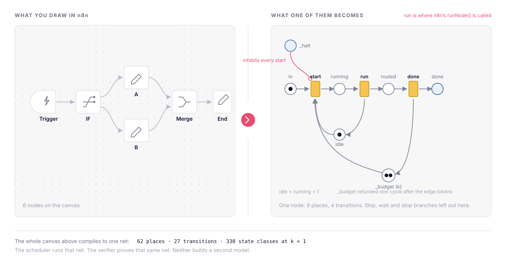
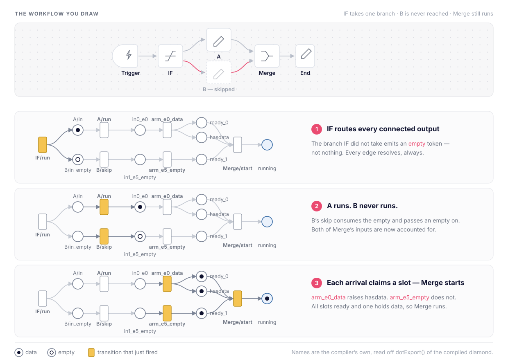
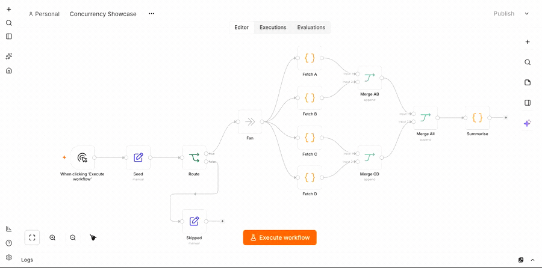
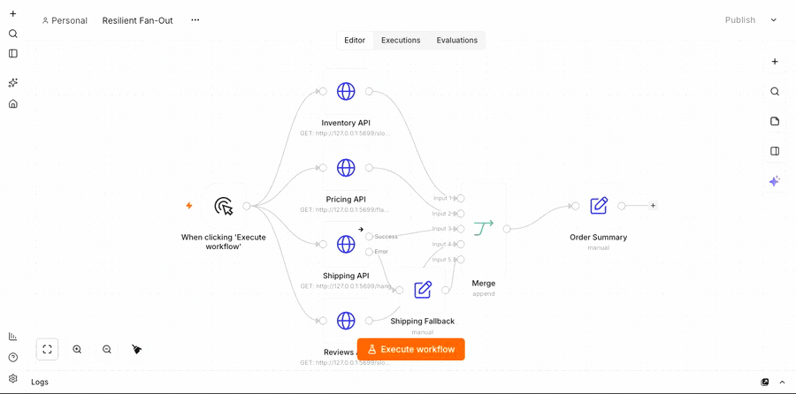
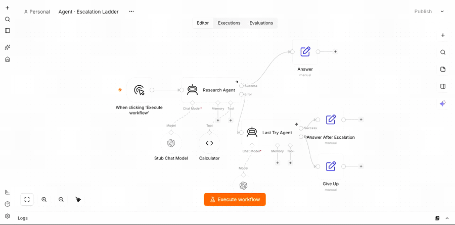

# n8n-libpetri

[](https://github.com/debe/n8n-libpetri/actions/workflows/ci.yml)
[](typescript/package.json)
[](https://github.com/debe/libpetri)
[](LICENSE)

n8n executes a workflow by running a scheduling loop over an explicit stack of pending nodes.
The loop is compact and effective, and it carries a complete scheduling model: the states a node
passes through, the condition under which it may run, the number of nodes that may run at once,
and the conditions under which an execution ends. That model is expressed as control flow and as
a small number of execution-global fields. A reader of the source can follow it; a tool cannot
read it.

n8n-libpetri restates that model as a coloured time Petri net, registered through the seam the
patches under `patches/n8n/` add. n8n keeps the editor, the workflow format, credentials, node
implementations, persistence, webhooks, hooks and queue mode.

Concurrency, cycles, joins, retries, resource limits and terminal states gain explicit semantics.
The scheduler executes that net; the verifier analyses the same net.

<picture>
  <source media="(prefers-color-scheme: dark)" srcset="docs/img/workflow-to-net-dark.svg" />
  
</picture>

*What the compiler does. Circles are places, bars are transitions, and a token sits in a place.
Four of these six nodes compile to exactly this gadget, wired to the shared `_budget` and `_halt`
places; `Trigger` drops the skip branch, and `Merge` adds the join below. `run` is the only
transition that calls `runNode()`.*

## Contents

1. [The scheduler in n8n today](#the-scheduler-in-n8n-today)
2. [What formalisation provides](#what-formalisation-provides)
3. [Principles](#principles)
4. [Scope](#scope)
5. [Execution model](#execution-model)
6. [Verification](#verification)
7. [Evidence](#evidence)
8. [In a real n8n](#in-a-real-n8n)
9. [Known limits](#known-limits)
10. [Building and testing](#building-and-testing)
11. [Repository map](#repository-map)

## The scheduler in n8n today

`WorkflowExecute.processRunExecutionData()` runs a loop of roughly 490 lines over an array of
pending entries, plus a side table holding the partly arrived inputs of multi-input nodes. Each
iteration takes one entry, runs that node, and appends the successors of every output that
produced items, sorted by canvas position.

Two conditions make it work, and the loop satisfies both by construction. It enqueues a
successor only when the output carried data, so a recovery pass completes any node still waiting
once the stack drains. One node runs at a time, which keeps the execution-global fields safe.

## What formalisation provides

Restating the model changes none of the work n8n performs. It changes what you can say about
that work before it runs. Three conditions the loop holds implicitly become objects in the net,
and analysis follows from having them.

**Waiting becomes a place.** A join in the net holds one slot per input and fires when the last
slot is claimed. An edge with no data for this activation claims its slot with an `empty` token, so "produced
nothing" arrives as a fact. A stack of pending entries carries arrivals but not absences, so a
waiting join there needs a recovery pass once the stack drains. The net needs none.

<picture>
  <source media="(prefers-color-scheme: dark)" srcset="docs/img/empty-token-dark.svg" />
  
</picture>

*The same six nodes, now running. `IF` takes one branch, so `B` never runs. The untaken branch
still emits an `empty` token, `B`'s skip passes that empty on, and `Merge` starts with both slots
claimed and one holding data.*

**The bound becomes a number.** One node at a time keeps `executionError`, `waitTill` and
`lastNodeExecuted` correct, and it holds as a property of the control flow rather than as a stated
number. The net states it as `_budget`: k tokens in one place, with the `budget` property checking
the law that follows. Two independent 500 ms branches take 1,006 ms today and 507 ms at k = 2.

**Execution state becomes data.** Progress is the marking, and `MarkingCodec` writes it into
n8n's own `nodeExecutionStack` and `waitingExecution`. Wait, resume and queue-mode handoff
therefore move a marking with a defined encoding, and nothing new is persisted.

**The model becomes analysable.** Whether a join can stay permanently unsatisfied is a question
about reachable states, and control flow alone cannot answer it. `proper-completion`
decides it on the state-class graph: `violated` on `ifBothOutputs` in 42 ms, with the firing
sequence named in nodes.

Petri nets are a standard formalism for concurrent and distributed systems, with an established
body of analysis to draw on. What ships today is one process with a configurable k. Raising k, or
moving an execution between workers, is a change to the budget and the marking.

The costs: about 16 µs of scheduler overhead per node; 4 of the 44 cases that drive the scheduler
regressed, all classified; cyclic and multi-producer-input workflows pinned to k = 1; `unknown`
on large parallel shapes, and `bounded` on cycles where the SMT fallback does not close them
(it proves the Loop Over Items fixture in half a second).

## Principles

1. **Every transition carries a real `Out` spec**, never `null`, never `skipOutputValidation`.
   The executor validates it and the verifier reads it: that is how one net serves both. The
   only null-spec transitions are genuine sinks (libpetri CORE-043 AC4).
2. **The net decides what runs.** Enablement follows from tokens, guards, inhibitors, read arcs,
   priorities and timed transitions. Nothing dispatches from the host: no queue, no permit
   gating, no policy object. Retries, mutual exclusion, concurrency limits and halts are places
   and arcs.
3. **Behaviour that follows from the stack discipline is a candidate for abandonment, not a
   requirement.** The net models the workflow's semantics, and
   [`docs/divergences.md`](docs/divergences.md) records every difference.
4. **Report only the direction the encoding licenses.** The verification abstraction is priority-
   and value-blind, so a witness stays a witness and never becomes a proof. No check claims more
   than its query asks.

## Scope

| n8n keeps | n8n-libpetri provides |
|---|---|
| Workflow JSON and editor | Workflow-to-net compiler |
| Node implementations and `runNode()` | `PetriScheduler` |
| Credentials, expressions and data proxy | Marking codec for resume state |
| Persistence, hooks, webhooks and queue mode | State-class and SMT verification |
| Execution-engine interface | Scheduler registration behind that interface |

n8n-libpetri supports v1 execution order only, and deliberately leaves v0 on n8n's scheduler.

An AI Agent's tool calls are part of the scope, and they are the one place the model changes what
a user sees rather than only what can be said about it. `AgentV3` returns an `EngineRequest`
instead of data when its model wants a tool; the compiler turns each `ai_tool` connection into a
dispatch arm, so a round of tool calls is a marking: bounded by the agent's own
`options.maxIterations`, resumable if the execution pauses inside it, and run `k`-wide
([ADR 0008](docs/adr/0008-agent-tool-dispatch.md)). Every other `ai_*`
connection is resolved by `supplyData` inside `runNode` and never reaches a scheduler.

## Execution model

One workflow execution creates one net. Each n8n node becomes a `SubnetDef` with places and
transitions for start, run, completion, skipping, retry and exhaustion. Shared places model
the concurrency budget, halt and pause state.

### Emission rule

An `empty` token on an acyclic edge asserts that the edge produced no data for this activation
of its producer. That assertion is what lets an AND-join complete or skip on its own.

Cycles need a different rule, because an empty token must not circulate forever. A node skipped
on an empty input would emit `empty` on its back edge, re-activating its predecessor's skip,
which emits `empty` again, without end. The compiler therefore decomposes the main-connection
graph into strongly connected components before emitting:

| Edge | Producer returned data | Producer skipped |
|---|---|---|
| Acyclic edge | `data` or `empty` | `empty` |
| Edge leaving a cyclic producer | `data` or local `nil` | `empty` |
| Edge inside a cycle | `data` or local `nil` | nothing |

A local sink consumes `nil`. It records that an output was not selected without inventing
traffic on a cycle. [ADR 0002](docs/adr/0002-emission-rule.md) records the decision.

### Per-node gadget

The normal path is:

```text
input + idle + budget -> running -> routed -> done + budget
```

In the gadget pictured at the top of this file, `start` acquires one `_budget` token. `run` calls
n8n's existing `runNode()` and routes the result. `done` refunds the token one scheduler cycle
later. The split models duration and makes the budget a structural property of the net:

```text
_budget + running + retry + in-flight routing = k
```

Each node also has an `idle` token, giving the invariant `idle + running = 1`.

Nodes with up to three connected outputs route directly from `run`. Wider fan-outs use one
routing transition per output. This avoids flattening an `and` of `n` `xor`s into `2^n`
branches.

Transition priority is DAG depth, so at k = 1 the net walks a workflow depth-first, as n8n's
loop does. [ADR 0004](docs/adr/0004-two-phase-budget.md) records the two-phase split.

### Retries, halt, cancellation

Retries hold the budget while they wait, as n8n's retry loop does. A fatal error deposits
`_halt`, and every new start and routing transition inhibits on it. Actions already in flight
may finish, and the marking codec then writes the pending activations back to n8n's resumable
state. Wait nodes and destination-node stops deposit `_pause` and are handled the same way.

### Join gadget and OR-inputs

A join has a `free` and a `ready` place for each input, and one `hasdata` place for the node.
An arriving edge claims its input slot. The node starts once all required slots are ready and at
least one holds data; otherwise it skips and propagates empty output. The places make slot
allocation and mutual exclusion explicit.

Several producers targeting one input form an OR-input, not an AND-join. Each data arrival may
activate the node. Empty-capable producers close a delivery round together, which keeps one
empty edge from prematurely skipping downstream work. The current round model is positional, and
interleaved arrivals can expose the FIFO/LIFO divergence recorded in
[`docs/divergences.md`](docs/divergences.md). [ADR 0003](docs/adr/0003-join-gadget.md) records
the gadget.

### Expression references

References such as `$('Y')` become read arcs on `Y/done` when `Y` is a valid upstream
dependency. A skipped or unreachable dependency produces n8n's unexecuted-node error under
the node's configured error policy. Self-, downstream- and loop-back references remain
runtime expression errors.

### Concurrency budget and its safety condition

The initial `_budget` marking is the maximum number of node actions that may be in flight. A
retry holds its unit while it waits, so concurrent runs are bounded by the budget and need not
reach it.
Independent enabled transitions can therefore run concurrently. The budget is a declared
invariant first and a throughput control second.

Above k = 1 one rule falls on node authors: **a node's input items are read-only**. n8n already
shares the producer's `INodeExecutionData` objects across every connection, so a node that
mutates its input `json` in place corrupts its sibling's input today. Concurrency makes the
result nondeterministic.

The compiler currently lowers the effective budget to one when a workflow contains a cycle or
several producers for one input index. Those shapes need activation lineage before their tokens
can be paired safely at `k > 1`. The budget-equivalence tests preserve run data at budgets 1, 2,
4 and 8 for k-safe workflows without completion-order-sensitive stop behaviour. Completion order
may change above one, by design. [ADR 0006](docs/adr/0006-concurrency.md) records the condition.

### Initial marking and the marking codec

The initial marking of one execution is `_budget` × k, one `X/idle` per node, one `X/free_i` per
join input whose slot is not pre-filled, `X/tries` per retry node, one `empty` token on the
`ready` place of every join input fed only by nodes unreachable from the start node, `Y/skipped`
for every referenced node unreachable from the start node, and the trigger items on the start
node's `in` place. Seeding unreachable inputs with `empty` performs n8n's recovery substitution
once, at decode time.

A running execution's progress is the marking, and n8n remains the system of record. Nothing of
the net is persisted. `MarkingCodec` encodes a quiescent marking into n8n's own
`nodeExecutionStack`, `waitingExecution` and `waitingExecutionSource`, and decodes them back by
layering them over the execution-independent part of the initial marking:

| n8n | marking |
|---|---|
| Stack entry | the entry on the consumer's `in` place, or on its edge place, in FIFO order |
| `waitingExecution[X][k].main[i]` holding items | a `data` token on `X/ready_i` |
| `waitingExecution[X][k].main[i] = []` | an `empty` token on `X/ready_i` |
| `waitingExecution[X][k].main[i] = null` | nothing; the input has not arrived |
| `runData[Y]` non-empty | `Y/done` |

Encoding runs only at quiescence, so nothing in flight is ever serialised. The encoder omits
`_budget`, `X/idle`, `X/free_i` and `X/tries`; the decoder re-seeds them, and rebuilds the `done`
and `skipped` markers from `runData`. Wait, resume and queue-mode handoff therefore work
with an unmodified `IRunExecutionData`, and the patches never touch persistence.
[ADR 0005](docs/adr/0005-marking-codec.md) records the mapping.

## Verification

The CLI compiles workflow JSON to the same net used by `PetriScheduler`:

```bash
cd typescript
npm ci
npm run build
npx n8n-libpetri verify ../workflow.json --budget 2 --property dead-nodes
```

Available properties:

- `proper-completion`
- `dead-nodes`
- `no-double-activation`
- `budget`
- `retry-bound`
- `mutual-exclusion`

The primary verifier explores libpetri's state-class graph. If that graph truncates, an
optional Z3/Spacer backend can try the remaining query. Results are deliberately narrow:

| Verdict | Meaning |
|---|---|
| `proven` | The explored model proves the property. |
| `violated` | A reachable counterexample exists. |
| `bounded` | No counterexample exists within the exact cyclic-run prefix shown. This is not a proof. |
| `unknown` | The verifier could not decide the property. |

Counterexamples are node paths through the production net. The verifier models control
flow, not item values, timing or total execution order. Independent branches can make the
state space grow combinatorially; productive cycles make it infinite. See
[`docs/verification.md`](docs/verification.md) for the exact guarantees, limits and
measurements, and [ADR 0007](docs/adr/0007-verification.md) for the decision.

## Evidence

| Surface | Result |
|---|---|
| Execution-engine suite, loop-driving | Legacy 44/44. Petri k=1: 40/44 — no restatement, agent dispatch is in scope. |
| Execution-engine suite, helpers | Legacy 1,613/1,613. Petri k=1: 1,613/1,613. |
| Core suite | The same 44 loop-driving cases at 40/44, with 2,080/2,080 helpers, across 2,124 cases. |
| n8n workflow package | 9,603 cases, identical to the unpatched baseline; the scheduler never runs there. |
| n8n CLI package | 20,328 cases pass; the scheduler is registered but never runs there. |
| Differential sweep | 25 fixtures at k=1,2,4: 55 pass, 20 registered divergences, 0 failures. |

The classifier marks 44 of the suite's 1,657 cases as loop-driving, so those 44 measure the
engine and the remaining 1,613 guard the seam against perturbation. All four regressions are
loop-driving and every one is a registered divergence: three are semantic differences in
stuck-join handling and OR/join ordering (#2, #11, #12); the fourth is an `EngineRequest` naming a
node the workflow never wired to its agent (#22), a shape a real agent cannot emit because its
actions come from those same connections. M7 took this from 35/44 with an eight-case restatement
to 40/44 with none. Widening to `packages/workflow` and `packages/cli` added 29,931 cases and no
new failure class. See [`docs/conformance-final.md`](docs/conformance-final.md).

The benchmark is a cost check, not an architectural argument. A warm 100-node zero-work chain
adds about 16 µs per node over n8n's loop on the measured machine. A 185-node workflow compiles to
a cached `PrecompiledNet` in under 9 ms. Independent 500 ms branches fill the configured budget.
Methodology and raw numbers are in [`docs/differential.md`](docs/differential.md).

## In a real n8n

Every number above comes from `FakeHost`, a structural mirror of the patched host. It runs n8n's
own execution-engine cases and it is deliberately not n8n:
[`docs/conformance-final.md`](docs/conformance-final.md) records the `cli` scope as *registered,
never entered*. Until the testbed, the process n8n ships had never constructed the engine.

`scripts/testbed/` boots that process — the real `packages/cli`, with the editor, node types, task
runner, credentials and persistence around it — installs `PetriScheduler` through an `--import`
preload, and seeds workflows so there is something to press.

<picture>
  <source media="(prefers-color-scheme: dark)" srcset="docs/img/fanout-dark.svg" />
  
</picture>

*One workflow, run twice in that server through the editor's own manual-run endpoint. Four Code
nodes sleep 2.5 s each on independent branches, and `Route` sends the other branch to `Skipped`,
so twelve of the thirteen nodes activate. n8n's loop takes one stack entry at a time. The net runs
whatever the marking says may run, which at k = 4 is all four legs. The bars are n8n's own
per-task clock, at 1:1.*

Besides the clock, the order is what changed, and that is what a declared budget buys:

```
n8n             Fan → Fetch A → Fetch B → Merge AB → Fetch C  → Fetch D → Merge CD → Merge All → …
libpetri k = 4  Fan → Fetch A → Fetch B → Fetch C  → Fetch D  → Merge AB → Merge CD → Merge All → …
```

n8n enqueues `Merge AB` as soon as both inputs arrive and runs it before starting `Fetch C`. The
net starts all four legs, because nothing in the net orders them. Every node still runs once on
the same input, and every realised dependency edge still holds.

| Workflow | Leg | Wall clock | Data vs n8n | Happens-before | Order |
|---|---|---|---|---|---|
| Concurrency Showcase, 13 nodes | n8n's loop | 10,166 ms | reference | 14 edges ok | reference |
| | net, k = 1 | 10,172 ms | identical | 14 edges ok | same |
| | net, k = 4 | **2,672 ms** | identical | 14 edges ok | reordered |
| Agent · Two Tools, 6 nodes | n8n's loop | 129 ms | reference | 2 edges ok | reference |
| | net, k = 1 | 129 ms | identical | 2 edges ok | same |
| | net, k = 4 | 130 ms | identical | 2 edges ok | same |
| Agent · Nested Agents, 8 nodes | n8n's loop | 939 ms | reference | 2 edges ok | reference |
| | net, k = 1 | 922 ms | identical | 2 edges ok | reordered |
| | net, k = 4 | **585 ms** | identical | 2 edges ok | reordered |

The second workflow is an AI Agent with two tools on `ai_tool` connections, driven by a local stub
model, so the dispatch round of [ADR 0008](docs/adr/0008-agent-tool-dispatch.md) is exercised by
n8n's own agent node rather than by a fixture. The third puts an agent inside an agent: its two
tools sleep 400 ms each, one of them behind a second agent, and at k = 4 the outer tool runs while
the inner agent is still working.

### Three runs, recorded

`scripts/testbed/record-demo.sh` signs in, frames the canvas, presses Execute workflow and records
until n8n's own REST API reports the execution finished. Each clip below is that recording.



*Concurrency Showcase at k = 4. Four legs hold a budget token each, so they start together.*



*Resilient Fan-Out. One branch retries on its own delay, one is abandoned at its deadline, and the
run still reaches `Merge`. Both behaviours are declared in the workflow JSON (ADR 0009).*



*Agent · Escalation Ladder. `Research Agent` spends a declared budget of two tool calls and routes
the exhaustion down its error output; `Last Try Agent`, reached only once that budget is empty,
answers. `Answer` and `Give Up` stay grey because neither path was taken — which is the point. The
stub answers at a real model's pace (1.3 s a call, 400 ms a tool) so the round has visible beats;
with an instant stub the whole ladder finishes in 700 ms and shows nothing.*

The testbed is an integration harness, not a conformance measurement. `scripts/run-conformance.sh`
stays the authority on case counts, and no seeded workflow reaches divergence #17, the one k > 1
behaviour change with a user-visible shape. Treat a green table here as evidence the seam holds,
not as licence to raise `k` everywhere. [`docs/testbed.md`](docs/testbed.md) covers how the engine
gets into the process, what the columns decide, and what the harness cannot see.

## Known limits

- An `EngineRequest` action naming a node with no `ai_tool` connection to its agent cannot be
  routed and fails by name (divergence #22). No real agent emits one.
- An agent may make at most `executionPolicy.maxToolCalls` tool calls per execution, 64 unless
  declared. This one is the scheduler's own rather than a fallback for an n8n setting
  (divergence #25). Verification explores every round size up to
  that budget, so an agent that declares none verifies as truncated, and the report says which
  value to declare. It is declared on the node, **not** in `parameters.options`: n8n rebuilds a
  node's `parameters` from its type's declared options, so the older `options.maxToolCalls`
  spelling never survived a live editor save (ADR 0009 §2).
- Cyclic and multi-producer-input workflows currently run with an effective budget of one.
- OR-input rounds do not yet carry activation lineage.
- Completion-order fields such as `lastNodeExecuted`, `waitTill` and the selected fatal error
  can differ when actions complete concurrently.
- An in-flight sibling may finish after another node halts the execution.
- Verification does not prove general liveness, value properties, timing or order.
- On a large parallel shape the state-class graph truncates, and at the default 60 s budget the
  report says `unknown`. That is the budget, not a boundary: `switch20` (22 nodes, 238 places)
  is **proven** by the SMT fallback in about 6 minutes. Read an `unknown` as "not within the
  time given" and raise `--timeout` before concluding anything about the workflow. Raising
  `--max-classes` does *not* help on this shape: the graph is still truncated at 400,000
  classes and 4 GB, so the solver is the only route that decides it.
- A cyclic search is `bounded` where the fallback does not close it — the graph alone can only
  ever bound a cycle; the fallback proves the Loop Over Items fixture in 0.5 s, and that is what
  a `proven` there rests on.

[`docs/divergences.md`](docs/divergences.md) and
[`docs/state-of-the-project.md`](docs/state-of-the-project.md) track these constraints.

## Building and testing

The integration targets n8n commit `441970b211d13a3ce547916b2b8ee93677b620e9`. The pinned
checkout lives in the ignored `.n8n/` directory and receives two small, rebasable patches. This
repository carries no n8n fork.

The TypeScript package requires Node 24 or newer.

```bash
cd typescript
npm ci
npm run check
npm test
npm run build
```

CI runs those four commands on Node 24, with z3 installed, for every push and pull request to
`main`; the badge above reports that job. The conformance scripts below are not part of it,
because they need the pinned n8n checkout.

To test against the pinned n8n checkout:

```bash
scripts/bootstrap-n8n.sh
scripts/run-conformance.sh --engines=legacy,libpetri
scripts/verify-patch.sh
```

Use `scripts/run-conformance.sh --engines=libpetri --budget=2` for a wider budget. The
script records cases whose workflow shape forced the effective budget back to one.

To run the actual n8n editor on the net rather than a test suite:

```bash
scripts/testbed/n8n-testbed.sh          # http://127.0.0.1:5678, two seeded demo workflows
scripts/testbed/diff-engines.sh         # both engines in a live server, compared
```

That is the leg [In a real n8n](#in-a-real-n8n) reports, and
[`docs/testbed.md`](docs/testbed.md) records in full.

## Repository map

| Path | Contents |
|---|---|
| `typescript/src/compiler/` | Workflow analysis and net construction |
| `typescript/src/scheduler/` | n8n scheduler, actions and compiled-net cache |
| `typescript/src/verify/` | Verification API, state graph, SMT fallback and CLI |
| `typescript/src/conformance/` | Reference scheduler and differential harness |
| `typescript/src/codec.ts` | Marking to and from n8n execution state |
| `patches/n8n/` | Two rebasable n8n integration patches |
| `spec/` | Executable requirements and traceability |
| `docs/adr/` | Architectural decisions and amendments |
| `docs/conformance-*.md` | Recorded n8n suite evidence |
| `scripts/testbed/` | A live n8n editor running on the net, and the two-engine comparison in it |

Start with the [project state](docs/state-of-the-project.md), then use
[verification](docs/verification.md), [differential testing](docs/differential.md),
[patching](patches/n8n/README.md), [scripts](scripts/README.md) and the
[live testbed](docs/testbed.md) for the relevant task.
Milestone history belongs in [`CHANGELOG.md`](CHANGELOG.md).

## License

Apache-2.0. See [`LICENSE`](LICENSE).
