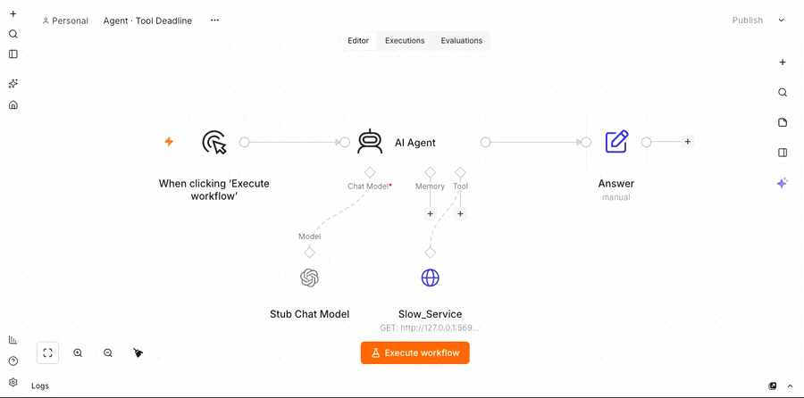
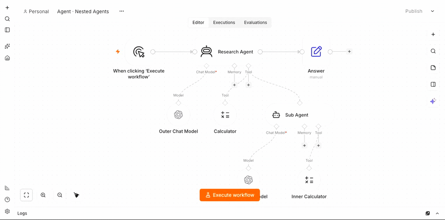

# The live testbed

Everything else in this repository measures the engine against `FakeHost`, a structural mirror of
patch 0001. It runs n8n's own execution-engine cases and diffs two schedulers against each other,
and it is deliberately not n8n: `docs/conformance-final.md` records the `cli` scope as
**registered, never entered**. The process n8n ships had never constructed the engine.

The testbed closes that gap. It boots the real `packages/cli` — editor, node types, task runner,
credentials, persistence — installs `PetriScheduler`, and seeds workflows so there is something
to press.

```bash
scripts/testbed/n8n-testbed.sh                 # libpetri, k = 4, http://127.0.0.1:5678
scripts/testbed/diff-engines.sh                # both engines, headless, compared
scripts/testbed/browser-check.sh               # drive the editor, screenshot the canvas
```

## What it is, and what it is not

An **integration and demonstration harness**, not a conformance measurement. No number here
belongs in a headline: `scripts/run-conformance.sh` remains the authority on case counts, and
`CLAUDE.md`'s reporting rule applies to it rather than to this. What the testbed adds is evidence
of a different kind — that the seam holds in the process carrying n8n's own dependency injection,
module loading, credential decryption and task-runner IPC.

## How the engine gets in

n8n does not read `N8N_EXECUTION_ENGINE`; patch 0002 exposes `setWorkflowSchedulerFactory` and
nothing more, and an external process decides whether to call it. The conformance suite calls it
from a generated vitest `setupFiles` shim. A server has no such seam, so the testbed calls it
from an `--import` preload, `scripts/testbed/preload.mjs`:

```
node --import scripts/testbed/preload.mjs .n8n/packages/cli/bin/n8n start
```

Three details decide whether that works.

**`createRequire`, not `import`.** `packages/core` builds to CommonJS and `n8n-libpetri` is
ESM-only, so the preload resolves `n8n-core` and `n8n-workflow` through a `require` rooted at
`packages/cli/package.json`. Node resolves pnpm's symlinks to their realpath, so the registry
the preload writes to is the same CJS module instance `WorkflowExecute` later reads from.

**`--import`, not `NODE_OPTIONS`.** `bin/n8n` never re-execs, so a command-line preload covers
the process. `NODE_OPTIONS` would also load it into the internal task-runner child, which never
constructs a scheduler.

**No fallback.** If any of that fails the preload throws and n8n does not start. A testbed that
quietly runs n8n's stack loop while reporting on the net is worse than one that refuses to boot.
Both directions are checked:

```
$ N8N_EXECUTION_ENGINE=legacy   node --import scripts/testbed/preload.mjs -e "0"
                                                     # inert, exits clean
$ N8N_EXECUTION_ENGINE=libpetri node --import scripts/testbed/preload.mjs -e "0"
Error: N8N_LIBPETRI_RESOLVE_FROM is not set          # refuses rather than degrades
```

### Two claims, two lines

The log carries them separately, because they are not the same statement:

```
[n8n-libpetri] scheduler registered: budget=4, hook=…/typescript/dist/index.js
[n8n-libpetri] engine entered: n8n constructed a scheduler through the registered factory
```

Registration is true at boot. **Entry** is `ENGINE_ENTERED_DIAGNOSTIC`, emitted by the factory
itself the first time n8n constructs a scheduler through it, and only an execution can
establish it. `docs/conformance-final.md` keeps the same distinction for the same reason.

### `packages/core` must be rebuilt

The server loads `packages/core/dist`, not `src`. A `dist` older than the patch runs an older
seam — and since M7, patch 0001 adds `planEngineRequest`, which the agent round calls. The
launcher rebuilds when `dist` is older than the patched source and then asserts both
`getWorkflowSchedulerFactory` and `planEngineRequest` are in the built file. The rebuild is
shared state with `scripts/run-conformance.sh --scope=cli`, whose own guard greps the same
built file; rebuilding from the patched source can only make that leg more correct.

## The ten workflows

All ten set `settings.executionOrder: "v1"`. Without it `PetriScheduler` delegates straight to
n8n's `StackScheduler` (divergence #3), and the testbed would be measuring n8n's own loop while
reporting on the net.

### Concurrency Showcase — 13 nodes

```
Manual Trigger → Seed → Route (If)
  false → Skipped
  true  → Fan → Fetch A | Fetch B | Fetch C | Fetch D     (Code, each sleeps 1.2 s)
Fetch A, Fetch B → Merge AB        Fetch C, Fetch D → Merge CD
Merge AB, Merge CD → Merge All → Summarise
```

Acyclic, with one producer per input index — which is what the k-safety check needs to leave
the budget alone. A cyclic SCC or a multi-producer index lowers the effective budget to 1, so
`Skipped` is a terminal node of its own rather than a second producer into `Merge All`: wiring
it there would have deleted the concurrency without saying so.

Every payload is deterministic. The legs return `{ leg: 'A' }` and not a timestamp, and
`Summarise` reports `{ legs: 4, order: 'A,B,C,D' }` — `append` concatenates input 0 then input 1
whatever order the branches finished in. The wall clock is measured from outside, so nothing
time-dependent has to travel through the data channel that the legacy/libpetri comparison reads.


*k = 4. Four legs hold a budget token each, so they start together.*

### Agent · Two Tools — 6 nodes

```
Manual Trigger → AI Agent (typeVersion 3.1, options.maxIterations 4) → Answer
Stub Chat Model  --ai_languageModel-->  AI Agent
Calculator       --ai_tool---------->   AI Agent
Fact_Lookup      --ai_tool---------->   AI Agent
```

`maxIterations` is the number the compiler seeds `A/rounds` from (ADR 0008 §2), which is what
makes the round cycle bounded. Two tools rather than one, because one exercises the round and
two exercise the **pending marker** — `A_dispatch` fires per call, `A/pending` counts them, and
`A_collect` closes the round when the last lands. Not the shared-tool shape: `agentSharedTool`
verifies as `violated` and it is a false alarm (`tasks/todo.md`).

The model is `scripts/testbed/stub-llm.mjs`, a local OpenAI-compatible server — no key, no
bill, no network, and a fixed script: the first call returns one `tool_calls` message naming
every tool the agent offered, the second returns a plain answer. Tool names and arguments are
read off the request's own `tools` array, so renaming a node cannot desynchronise the stub.

Two configuration details are load-bearing. n8n reaches the stub through the **credential's**
`url`, because `LmChatOpenAi` only validates `options.baseURL` and takes `credentials.url`
unguarded. And `responsesApiEnabled` defaults to **true** at typeVersion ≥ 1.3, so the workflow
turns it off explicitly; otherwise the node calls `POST /v1/responses` rather than chat
completions.

### Agent · Tool-Call Budget — 7 nodes

```
Manual Trigger → Confused Agent (maxIterations 30) ─0→ Answer
                                                   └─1→ Budget Exhausted
Stub Chat Model  --ai_languageModel-->  Confused Agent
Calculator       --ai_tool---------->   Confused Agent
Fact_Lookup      --ai_tool---------->   Confused Agent
```

An agent that keeps asking. Its prompt carries the marker `[stub:loop]`, which makes
`stub-llm.mjs` answer **every** call with tool calls and never with `finish_reason: "stop"`: a
model that never decides it is done, made deterministic and offline. The marker travels in the
workflow's own prompt, so nothing outside the workflow arms it.

The agent declares:

```jsonc
"onError": "continueErrorOutput",
"executionPolicy": { "v": 1, "maxToolCalls": 6,
                     "onFailure": [ { "action": "route", "output": "error" } ] }
```

`onError` declares the *port* — `NodeHelpers.getNodeOutputs` appends the error output on that
field alone — and `onFailure` declares the *policy* that reaches it. This is the pair ADR 0009 §1
separates, in the one shape where the difference is visible: n8n has no tool-call budget to run
out of, so without the policy there would be nothing to route.

`maxIterations` is deliberately left at n8n's own default of 30, because the two bound different
things: it caps *rounds*, and a model may request any number of calls within one round.

**Measured, one manual leg each** (`n8n execute` through `scripts/testbed/run.mjs`; the legacy
leg came from `diff-engines.sh`, the net leg from a `--daemon` server at k = 4):

| leg | model calls | tool executions | how it ended | node status | wall |
|---|---|---|---|---|---|
| legacy | 30 | **60** | `Max iterations (30) reached` | `success` | 378 ms |
| libpetri k=4 | 4 | **6** | `Tool-call budget (6) reached` | `error` | 579 ms |

Both route the failure to `Budget Exhausted`, and both finish the execution as `success` — the
declared branch is taken either way. What differs is how much work it takes to get there:
**ten times the tool calls**, which against a real model rather than a local stub is ten times
the requests.

Two details worth stating rather than smoothing over:

- **The node statuses differ, and legitimately.** `checkMaxIterations` throws *inside* the
  agent's `Promise.allSettled` batch (`ToolsAgent/V3/helpers/executeBatch.ts:81`); under
  `continueOnFail` the rejection becomes a per-item `{ json: { error } }` on the success path,
  which is divergence #27's mechanism, so the node is `success` with an error item. Our budget is
  an engine-level failure raised before `runNode`, so it goes through
  `handleNodeExecutionError` and the node is `error`. Same destination, different cause.
- **The tools show 4 runs each, of which the 4th never executed** — divergence #29. n8n's
  `handleRequest` reserves a `runData` slot per requested action before anything runs; the net
  then declines to dispatch the two the budget cannot pay for, and the reservation stays behind
  with `startTime: 0`.

`tests/scheduler/agent.test.ts` pins the same mechanism against `FakeHost`, deterministically
and without a server.

### Agent · Tool Deadline — 5 nodes

```
Manual Trigger → AI Agent (maxIterations 3) → Answer
Stub Chat Model  --ai_languageModel-->  AI Agent
Slow_Service     --ai_tool---------->   AI Agent      (HTTP Request Tool -> stub /hang)
```

The policy is on the **tool**, which is the node that actually calls the service:

```jsonc
"executionPolicy": { "v": 1, "timeoutMs": 3000, "onFailure": [ { "action": "continue" } ] }
```

`/hang` never answers and the socket is deliberately left open — [IO-013] is explicit that
abandoning a firing is a capability, not a guarantee, and this is where that shows. The workflow
sets `settings.executionTimeout: 20`, because n8n's whole-execution timeout is the *only* bound
it has here: there is no per-tool deadline at any level, and `maxIterations` does not help, since
the agent never gets as far as a second iteration.

Only three of the four actions mean anything on a tool. A tool's outcome is its agent's
`A/response`, not a main edge, so `route` has nowhere to go and the compiler refuses it by name.
`continue` is n8n's own default for a failing tool: it continues an `ai_tool` node so the agent
receives the error as its tool response (`workflow-execute.ts`). `retry` and `stop` behave as
they do anywhere else.

**Measured, one leg each:**

| leg | `Slow_Service` | `AI Agent` | execution | wall |
|---|---|---|---|---|
| legacy | never completes, status unset | never recorded | **canceled**, `finished: false` | **20,083 ms** |
| libpetri k=4 | `error` — *"Attempt 1 of \"Slow_Service\" did not finish within 3000 ms and was abandoned"* | `success` | **success** | **3,592 ms** |

Same workflow, same hung service, two bounds at different scopes. n8n's applies to the whole
execution, so it ends the whole execution; the per-tool deadline loses the tool call and nothing else — the agent receives the
error as its tool response, answers, and `Answer` runs. `tests/scheduler/agent.test.ts` pins the
same four behaviours against `FakeHost` without a server.



*`Slow_Service` goes red at its 3 s deadline. The agent receives the error as its tool response and `Answer` still runs.*

### Agent · Nested Agents — 8 nodes

```
Manual Trigger → Research Agent → Answer
                   ai_tool ↑ Calculator
                   ai_tool ↑ Sub Agent  (@n8n/n8n-nodes-langchain.agentTool)
                                ai_tool ↑ Inner Calculator
```

`Sub Agent` is n8n's `AgentToolV3`: an agent wired as another agent's tool. Its description is
`outputs: [NodeConnectionTypes.AiTool]` with every input `ai_*`, and its body is
`toolsAgentExecute` — the same executor the top-level `Agent` runs — so it emits an
`EngineRequest` for *its* tools exactly as a top-level agent does. After the adapter filters
inputs to `main`, its shape is a plain tool's, which the generated catalogue confirms
(`@n8n/n8n-nodes-langchain.agentTool@3` → `{inputCount: 0, outputCount: 0}`).

That makes it the one node in the model that is a **tool and an agent at once**, and nothing in
the gadget was written for the combination: `joinFormOf` returns `'tool'` for `isTool`, while the
whole round block is added for `tools.length > 0`. They compose. `Sub Agent` gets a tool's input
side (`B/in_tool`, and none of `in` / `in_empty` / `skipped`) and an agent's round entire, and
the two meet in one `X_run` `xor` — the tool branch writes the parent's `A/response`, the request
branch writes its own `B/routed_req`. The branches are disjoint, which is what IO-015's
exact-explanation search needs. `tests/compiler/agent.test.ts` pins the place and transition sets
by hand rather than by a recorded count.

| leg | status | wall clock | data vs reference |
| --- | --- | --- | --- |
| legacy (reference) | success | 594 ms | — |
| libpetri k=1 | success | 587 ms | **identical** |
| libpetri k=4 | success | 567 ms | **identical** |

**This leg is parity, and the wall clocks are not a result** — the workflow is stub-LLM bound,
not scheduler bound, and three numbers within 5% of each other say nothing about either engine.
What it establishes is that depth-2 delegation runs in the process n8n ships, under both engines,
with every payload equal. Both happens-before edges hold on every leg.

The order does move, and only in one place:

```
legacy:      … → Inner Chat Model#0 → Inner Calculator#0 → Sub Agent#0 → Inner Chat Model#1 → Calculator#0 → …
libpetri k=4: … → Calculator#0 → Inner Chat Model#0 → Inner Calculator#0 → Sub Agent#0 → Inner Chat Model#1 → …
```

`Calculator` is the *outer* agent's other tool, requested in the same round as `Sub Agent`. n8n
runs the round's calls one after another, so `Calculator` waits out the entire inner agent;
the net holds only the ordering the data forces, so at k=4 it goes first. Nothing downstream
depends on which, and the data is identical either way — which is the distinction the differ
draws between a reordering and a difference.

The two runtimes bound delegation differently. n8n's newer agent runtime identifies a delegated
task by a path string and accepts one level below the root, so a second level of delegation is
rejected when that path is parsed rather than by a check written for the purpose. Here the depth is
the graph, and the bound is a marking at every level: each agent spends its own `A/calls`,
nothing refunds either, and z3 validates one conservation law spanning both rounds. An inner
agent that exhausts its budget fails by name *inside itself*, and n8n's own rule for a failing
`ai_tool` node hands that error to the agent above as an ordinary tool response — so a runaway
at depth 2 is contained at depth 2 and the execution still completes
(`tests/scheduler/agent.test.ts`).

The cost is real and is stated rather than hidden. Two nested agents close in 19,523 state
classes at `maxToolCalls` 2 and 202,164 at 3; at 4 the solver-free route runs out of heap before
it closes (`effectiveMaxClasses` clamps to what the heap affords — 263,737 on this machine). The
SMT route still answers past that point, which is what it is for.



*Depth 2. `Sub Agent` is an agent wired as a tool, with a tool of its own.*

### Waiting Child + Parent Waits On Child — 3 nodes each

```
Parent:  Manual Trigger → Call The Child (Execute Workflow) → Parent Result
Child:   Execute Workflow Trigger → Wait 70s → Child Result
```

The parent cannot know the child's id before the child is seeded, so it carries
`__WORKFLOW_ID:Waiting Child__` and `seed.mjs` binds it — the same rule as the stub's port and
the credential: nothing under `workflows/` hardcodes instance state.

**70 seconds is the point, not an accident.** n8n's Wait node has a threshold a little over a
minute. A shorter wait is held in process on a timer; only a longer one suspends the execution and
writes a `waitTill`. The threshold applies to the computed remaining wait, so it governs both the
interval and the fixed-time forms.

Under it n8n **holds the execution active**; over it, n8n suspends. Measured both ways, with the
node's own `executionTime` telling them apart:

| child waits | `Call The Child` executionTime | what happened |
|---|---|---|
| 4 s | **4,036 ms** | the node was held for the whole wait; nothing suspended |
| 70 s | **0 ms** | the node suspended, the marking was written, and it re-ran on resume |

At 70 s the parent suspends on `putExecutionToWait(WAIT_INDEFINITELY)`
(`base-execute-context.ts:193`), n8n's `WaitTracker.resumeParentExecution` wakes it once the
child finishes, and the child's output crosses the boundary intact.

**Both engines, 70 s child:** legacy 70,161 ms, libpetri 70,143 ms, **data equal**, every payload
identical. This leg is parity: n8n handles nested waits correctly and so does the net. What it
establishes is that a suspended parent survives the marking round trip in a real server, which
every resume claim rests on.

The sub-cliff case is where the two differ: a node held by `setTimeout` holds its
`_budget` unit for the entire wait, and `executionPolicy.timeoutMs` is the only thing in either
engine that can bound it (see **Agent · Tool Deadline**). n8n has a second cliff of the same
shape in its agent bridge — `WAIT_POLL_ELIGIBLE_MS = 60_000`, under which it polls the database
every two seconds and over which it asks a human to press a button.

### Agent · Escalation Ladder — 9 nodes

```
Manual Trigger → Research Agent ─0→ Answer
                  (maxToolCalls 2) └─1→ Last Try Agent ─0→ Answer After Escalation
                                        (maxToolCalls 1)  └─1→ Give Up
Stub Chat Model      --ai_languageModel--> Research Agent
Calculator           --ai_tool----------->  Research Agent
Last Try Chat Model  --ai_languageModel--> Last Try Agent
```

An escalation written as graph rather than as a branch inside a node. The first agent carries
`[stub:loop]`, so it never finishes on its own. Its declared budget is two, and the `onFailure`
step routes the exhaustion to its error output instead of ending the execution. That output feeds
a *second* agent with a different instruction — "you have one attempt left, answer from what you
already know" — whose own error output is the give-up path.

Measured, one run: `Calculator` ran twice, `Research Agent` ended `error` with
`Tool-call budget (2) reached`, `Last Try Agent` answered without calling a tool, and
`Give Up` never ran. 566 ms.

The point is where the escalation lives. No node asks "is this the last try"; the budget is a
place, the second agent is reached only when that place is empty, and the give-up path is an
edge nothing takes until the one above it is spent. Each of the three outcomes is a different
region of the graph, so each is something the verifier can reason about.


*`Research Agent` spends its budget of two and routes the exhaustion down its error output. `Answer` and `Give Up` stay grey because neither path was taken. `Calculator` ran twice and carries no badge — divergence #29, below.*

### Failure Policy Showcase — 5 nodes

Two branches off the trigger, each calling the testbed's own stub over HTTP:

```
Trigger ─┬─ Flaky Service (/flaky?fail=2) ── Recovered
         └─ Hung Service  (/hang)         ── Gave Up
```

`Flaky Service` returns 503 twice for a given key and then 200, so the failure is a real non-2xx
and a real n8n node error rather than a `throw` in a Code node. `Hung Service` never answers.
Neither node sets `retryOnFail` or `onError`; each carries an `executionPolicy` (ADR 0009):

```jsonc
"Flaky Service": { "v": 1, "onFailure": [
  { "action": "retry", "waitMs": 250 }, { "action": "retry", "waitMs": 1000 }, { "action": "stop" } ] }

"Hung Service":  { "v": 1, "timeoutMs": 1500, "onFailure": [
  { "action": "retry", "waitMs": 0 }, { "action": "continue" } ] }
```

The stub keys `/flaky` on `$execution.id`, so every run starts from a fresh failure count.

### Resilient Fan-Out — 7 nodes

Both halves together: concurrency and resilience, declared in the workflow rather than arranged
by the engine's configuration.

```
Trigger ─┬─ Inventory API (/slow?ms=3000) ─┐
         ├─ Pricing API   (/flaky?fail=2)  ├─ Merge (4 inputs) ── Order Summary
         ├─ Shipping API  (/hang)          │
         └─ Reviews API   (/slow?ms=3000) ─┘
```

Four independent branches, so the budget has something to spend. Two are healthy and slow, one
fails twice before recovering, one never answers. The two that need a policy declare one:

```jsonc
"Pricing API":  { "v": 1, "onFailure": [
  { "action": "retry", "waitMs": 400 }, { "action": "retry", "waitMs": 800 }, { "action": "stop" } ] }

"Shipping API": { "v": 1, "timeoutMs": 2500, "onFailure": [
  { "action": "retry", "waitMs": 0 }, { "action": "continue" } ] }
```

Every node is an ordinary `n8n-nodes-base.httpRequest` against the testbed's own stub, and the
Merge is n8n's own. Nothing here is a Petri net concept: the workflow reads as a workflow.


*Four branches at once. `Pricing API` retries, `Shipping API` is abandoned at its deadline, and `Merge` still runs.*

## What was measured

n8n 2.37.0 at the pin `441970b2`, Node 26.8.1, macOS, k as shown, best of two runs per leg,
2026-09-10. `diff-engines.sh` produced this.

| Workflow | leg | wall clock | data vs n8n | happens-before | order |
| --- | --- | --- | --- | --- | --- |
| Concurrency Showcase | legacy (reference) | 4944 ms | — | 14 edges ok | — |
| | libpetri k = 1 | 4944 ms | identical | 14 edges ok | same |
| | libpetri k = 4 | **1284 ms** | identical | 14 edges ok | **reordered** |
| Agent · Two Tools | legacy (reference) | 131 ms | — | 2 edges ok | — |
| | libpetri k = 1 | 129 ms | identical | 2 edges ok | same |
| | libpetri k = 4 | 130 ms | identical | 2 edges ok | same |

Four independent 1.2 s legs, so 5 s sequentially and 1.2 s four-wide: the net returns 1284 ms
against n8n's 4944 ms, and costs nothing measurable at k = 1 — 4944 ms, the same figure to the
millisecond. The reorder is the whole difference —

```
n8n            … Fan → Fetch A → Fetch B → Merge AB → Fetch C → Fetch D → Merge CD → …
libpetri k = 4 … Fan → Fetch A → Fetch B → Fetch C  → Fetch D → Merge AB → Merge CD → …
```

n8n enqueues `Merge AB` as soon as its two inputs have arrived and runs it before it starts
`Fetch C`; the net starts all four legs, because nothing orders them. Every node still runs
exactly once with the same payload, and every realised dependency edge is still respected.

### How each column is decided

The three are kept apart on purpose, because the claim is that **the data is identical and the
order is not** — folding them into one verdict would report the feature as a failure.

- **Data** compares each node's `ITaskData` field by field, minus `startTime`, `executionTime`
  and `executionIndex`. That field list mirrors `comparableTask` in `src/conformance/differ.ts`,
  which leaves the same three out for the same reason: they are clocks and positions, not data.
- **Happens-before** takes `dependencyEdges` from the same module — the *realised* dependency
  graph, read off the `source` n8n stamps on every task — and checks each edge inside each leg.
  The observation is n8n's own per-task clock, since a live server produces no `runNode` trace;
  an edge holds when the producer's `startTime + executionTime` is at or before the consumer's
  `startTime`. Independent activations are free to be unordered: that is the concurrency.
- **Order** is `executionOrder` over n8n's own `executionIndex`. Reported, never asserted.

### The failure policy, both engines

Run through the same manual-execution endpoint, 2026-09-10, k = 4:

| leg | outcome | wall | Flaky Service | Hung Service | downstream |
| --- | --- | ---: | --- | --- | --- |
| legacy (n8n's own loop) | **error** | 70 ms | `error` on the first 503 | never reached | neither ran |
| libpetri, chain declared | **success** | 3,086 ms | `success` after 3 calls | `error` after 2 × 1,500 ms | both ran |

Three things this leg is for, none of which a unit test can show:

- **The carrier survives the real stack.** The policy goes in through the same
  `POST /rest/workflows` the editor uses and comes back out of the database byte-for-byte. That
  is the claim ADR 0009 §2 rests on, and the types alone cannot establish it.
- **The deadline ends a hang.** A service that never answers costs 3 s and a recorded error
  instead of holding the node until n8n's whole-execution timeout. The socket stays open — IO-013
  is explicit that abandoned work is not cancelled — and the run finishes anyway.
- **The layering test passes.** n8n's own scheduler ran the *same document* without complaint,
  ignoring a key it does not know. A workflow carrying an execution policy stays meaningful under
  the engine that cannot honour it, which is what makes the carrier an interface rather than a
  leak.

The legacy row is not "n8n cannot retry": `retryOnFail` would have recovered the flaky branch.
It is that the declared policy is ignored, and that n8n has no per-attempt delay and no per-node
deadline to declare in the first place.

### Resilient Fan-Out, three legs

Same workflow, same stub, through the manual-execution endpoint, 2026-09-10:

| leg | outcome | wall | what happened |
| --- | --- | ---: | --- |
| legacy (n8n's own loop) | **error** | 3,106 ms | Inventory ran, Pricing hit its first 503, the execution stopped. Shipping, Reviews and Merge never ran |
| libpetri k = 1 | **success** | 12,654 ms | every branch answered, one after another |
| libpetri k = 4 | **success** | **5,123 ms** | every branch answered, all four in flight |

The k = 4 timeline, from n8n's own per-task clock:

| node | status | started | took |
| --- | --- | ---: | ---: |
| Trigger | success | +0 ms | 1 ms |
| Pricing API | success | +2 ms | 1,258 ms |
| Inventory API | success | +2 ms | 3,014 ms |
| Reviews API | success | +2 ms | 3,015 ms |
| Shipping API | **error** | +2 ms | 5,057 ms |
| Merge | success | +5,060 ms | 2 ms |
| Order Summary | success | +5,062 ms | 1 ms |

All four branches start within **2 ms** of each other, and the run is bounded by the slowest of
them rather than by their sum — 5,123 ms against 12,654 ms sequential, a 2.5× cut on a workflow
whose author wrote no concurrency anywhere. Pricing's 1,258 ms is three calls with 400 ms and
800 ms between them; Shipping's 5,057 ms is two attempts abandoned at their 2.5 s deadline,
after which `continue` let the branch carry a payload into the Merge and the workflow finish.
The legacy leg is the same document under the engine that ignores the policy.

### Reading the canvas: why the Error arc is grey

Shipping API's Error arc is labelled **1 item** and drawn **grey**. Both are correct; they answer
different questions. Worth knowing before anyone films it and worries.

The label comes from `runDataTotal` on the connection. The stroke comes from the *source node's*
status, through four steps in n8n's own editor:

1. `handleNodeExecutionError` sets `taskData.executionStatus = 'error'` unconditionally, even for
   a failure it then continues past. Shipping API really did fail, twice.
2. `computeHasIssues(nodeId)` returns true for `'error'` or `'crashed'`
   (`useWorkflowDocumentRenderData.ts`).
3. `getConnectionStatus` matches `error: hasIssuesByNodeId.get(connection.source)`, and
   `CONNECTION_STATUS_PRIORITY = ['running', 'pinned', 'error', 'success']` — **`error` outranks
   `success`**, so the arc is `error` even though `success` matched too
   (`useCanvasMapping.ts`).
4. `CanvasEdge.vue` colours only `success` and `pinned`; everything else falls through to grey.

So **grey means "the source node has issues", not "no data flowed"**, which is why *both* of
Shipping API's arcs are grey, the Success one included. This is n8n's rendering rather than the
engine's: in the ordinary n8n case an error-output arc is green, because the node emitted per-item
errors and kept its own `success` status, so `hasIssues` is false and `success` wins. A whole-node
failure is red, and a red node's arcs are grey.

Making it green would mean stamping the node `executionStatus: 'success'` — untrue, and it would
remove the red badge that is the point of the frame.

### Recording a run

```bash
scripts/testbed/record-demo.sh                       # Resilient Fan-Out at k = 4
scripts/testbed/record-demo.sh --workflow="Agent · Two Tools" --budget=1
```

Video: `.testbed/video/<workflow>-<engine>-k<budget>.webm`, continuous at 10 fps. The clips above
are these recordings, converted to GIF.

Three things the script has to get right.

**It records with `agent-browser record`, which opens its own browser context.** That context
carries none of this machine's cookies, so it lands on the sign-in page. The sign-in therefore
happens inside the recording and the front of the file is trimmed afterwards — re-encoded rather
than stream-copied, since a copy can only cut on a keyframe and at 10 fps that rounds the cut to
somewhere unhelpful. An earlier version assembled PNG screenshots at 2 fps, believing the
screencast was change-driven; it is not.

**It frames the canvas** by clicking n8n's own Zoom to Fit control, after a fresh snapshot. Refs
go stale across a navigation, and the keyboard shortcut only lands when focus is already on the
canvas pane, which after a page load it is not. Without this the recording is whatever pan the
editor restored, with the first node half under the sidebar.

**It sends no keystrokes to the canvas.** n8n saves a workflow before a manual execute, so an
editing keystroke from the recorder is written back into the fixture. One earlier attempt at the
zoom added a sticky note that way.

Completion comes from n8n's REST API rather than from the DOM, because the success toast
auto-dismisses and `get text` does not reliably carry it.

## Queue mode: the engine in the worker

```bash
redis-server --port 6399 --save '' --appendonly no --daemonize yes
scripts/testbed/n8n-testbed.sh --queue --daemon
```

Everything above runs n8n in `regular` mode, where one process both serves the editor and
executes. Production usually does not: `EXECUTIONS_MODE=queue` makes `n8n start` a producer that
puts a job on Redis, and a separate `n8n worker` process consumes it. **That is where the engine
has to be**, because in queue mode the main process never constructs a scheduler for a queued
execution — `WorkflowExecute.processRunExecutionData()` is called in the worker, at
`packages/cli/src/scaling/job-processor.ts`.

So the worker gets the same `--import` preload the main process gets, and the launcher refuses
to continue if the worker's log does not carry `scheduler registered`. A worker without it would
run n8n's own stack loop while the main process's log still said the engine was installed — the
failure the preload's "no fallback" rule exists to prevent, one process over.

Three things had to be true, and each was found by hitting it:

1. **The worker needs its own task-broker port.** Every n8n process starts an internal broker on
   `N8N_RUNNERS_BROKER_PORT`, default 5679, and the main process already has it — the worker
   exits with *"n8n Task Broker's port 5679 is already in use"*. The launcher gives it
   `--port + 2`.
2. **A manual execution is not enqueued at all.** `workflow-runner.ts` enqueues only when
   `mode === 'queue' && executionMode !== 'manual'`, unless
   `OFFLOAD_MANUAL_EXECUTIONS_TO_WORKERS=true`. Everything the testbed drives is a manual
   execution, so without that flag the main process runs the workflow in-process and the worker
   sits idle — a leg that would have measured `regular` mode while calling itself queue mode.
   The first run of this did exactly that: `engine entered` appeared in the *main* log and the
   worker log had none.
3. **Redis carries a pointer, not the marking.** The job payload is `{ executionId, … }`
   (`scaling.types.ts`); the worker loads `execution.data` — the whole `IRunExecutionData`, our
   marking included — from the **database**. So queue mode changes the process topology and
   nothing about the path ADR 0005 depends on, and *"n8n stays the system of record"* holds
   unchanged.

### What it proves

Every activation ran in the worker: `engine entered` appears **once in the worker log and zero
times in the main log** across the whole run. The main log shows only `Enqueued execution N
(job M)`.

The resume is the part worth having:

```
Worker started execution 136 (job 6)     Parent Waits On Child, runs to the Wait, suspends
Worker started execution 137 (job 7)     Waiting Child, its own 70 s Wait, suspends
Worker started execution 136 (job 8)     the same execution, a different job — resumed
```

Execution 136 appears twice under **two different job ids**. The marking the codec wrote in job
6 was persisted, re-enqueued when the wait elapsed, and read back by job 8, which completed the
execution. That is the marking round trip through Redis and the database rather than through one
process's memory — and it is the claim every resume in this project rests on.

| workflow | regular k=4 | queue k=4 | data |
| --- | --- | --- | --- |
| Concurrency Showcase | 1,346 ms | 1,293 ms | **identical** |
| Agent · Two Tools | 514 ms | 580 ms | **identical** |
| Agent · Nested Agents | 134 ms | 133 ms | **identical** |
| Resilient Fan-Out | 5,091 ms | 5,255 ms | **identical** |
| Parent Waits On Child | 70,145 ms | 70,306 ms | identical but for the child's execution id |

Same order on every one, and every happens-before edge holds. The last row's only difference is
`runData['Call The Child'][0].metadata.subExecution.executionId` — the child execution's database
id, which two runs cannot share; comparing the two `runData` trees with database ids and
timestamps excluded gives **zero** differences. **This is parity, not an advantage**, and the
wall clocks are not a result either: the two legs are within noise of each other, which is what
you would expect when the work is the same and only the process boundary moved.

### The caveat

n8n logs *"Scaling mode is not officially supported with sqlite. Please use PostgreSQL
instead."* and continues. The testbed keeps sqlite, because the claim being made here is about
where the engine runs and what survives the round trip, not about database concurrency — but a
queue-mode leg on sqlite is n8n running outside its supported configuration, and no number from
it should be read as a statement about queue mode under load. A Postgres leg is the honest way
to make that stronger claim and has not been run.

## How a waiting sub-workflow reaches an agent

```bash
N8N_ENABLED_MODULES=agents scripts/testbed/n8n-testbed.sh --daemon
```

`scripts/testbed/n8n-testbed.sh` with `N8N_ENABLED_MODULES=agents` boots n8n's **new** agent
runtime (`packages/cli/src/modules/agents`, not a default module). Its agents are created over
REST at `/rest/projects/:projectId/agents/v2`, their model is `provider/model` with an ordinary
n8n credential, and `openai: (c) => ({ apiKey: c.apiKey, baseURL: c.url })`
(`json-config/credential-field-mapping.ts:18`) means the testbed's existing stub-OpenAI
credential drives it unchanged. So `stub-llm.mjs` can drive `@n8n/agents`, which was the open
question.

What that buys is a measurement of **their** half of the wait problem: an agent calls a
sub-workflow as a tool, and the sub-workflow waits. Two constants decide what happens, and they
are in different packages:

| constant | value | where |
| --- | --- | --- |
| the Wait node's hold-vs-suspend threshold | `65000` | `nodes-base/nodes/Wait/Wait.node.ts:596` |
| the agent tool's poll-vs-human threshold | `WAIT_POLL_ELIGIBLE_MS = 60_000` | `cli/src/modules/agents/tools/workflow-tool-factory.ts` |

`isPollableWait` is `waitTill - now <= 60_000` (`:784`). The Wait node computes `waitTill` and
then, if the remaining wait is under 65 s, blocks in-process on a `setTimeout` and never suspends
at all — for `timeInterval` and `specificTime` alike, since the check is on the computed
`waitValue`. **The two thresholds therefore do not overlap**: under 65 s there is no `waiting` execution
for the agent to poll, and at 65 s or more the `waitTill` is already further out than 60 s.

Measured, both sides, one agent with one workflow tool re-pointed between runs:

| child waits | what the agent's turn did | elapsed |
| --- | --- | --- |
| 30 s | `tool-execution-start` → `tool-execution-end`, `status: "success"`, real output | **blocked 30.1 s** |
| 70 s | `tool-call-suspended`, a `workflow_wait` card | **0.7 s** |

The 30 s tool call held the agent's turn open for the whole thirty seconds and then returned
`{"Child Result":[{"childSaid":"the child woke up and finished"}]}` — no suspension, no polling,
because the Wait node never let the execution reach `waiting`. The 70 s call suspended in under a
second and handed back a card titled `Waiting on "Waiting Child"` with two buttons,
**"Check for the result"** and **"Stop waiting"** (`buildWaitCard`, `:823`). A human has to press
one.

The poll window therefore does not apply to a Wait node. It is reached where
something else sets a short `waitTill` — `Form` and the `sendAndWait` operations through
`configureWaitTillDate`, whose default is `WAIT_INDEFINITELY` and whose `limitWaitTime` would
have to be set under a minute. That is a human-approval *timeout*, not work finishing.

This is the default configuration rather than a corner: `backgroundTasksEnabled` defaults to `false`
(`@n8n/config/src/configs/agents.config.ts`), so the background-job path between the two is
off, and `supportsHitl` defaults to `true` (`workflow-tool-factory.ts`).

### The same case under the net

A waiting sub-workflow is a **marking**. The parent's `Call The Child` records
`executionTime: 0 ms`, the marking is written to `IRunExecutionData`, and the execution resumes
when the wait elapses — 70,143 ms end to end against legacy's 70,161 ms, every payload identical
(*Waiting Child + Parent Waits On Child* above). In queue mode the same execution came back as a
**different job id** and completed there (*Queue mode* above), so the marking survives a process
boundary as well as a suspension.

Nothing blocks and nobody is asked to act. Both of n8n's behaviours are reasonable ones —
blocking a chat turn for thirty seconds is a fair trade, and asking a person about a wait
measured in hours is often the right call. Keeping the wait as a marking is a third option, and
it is available here because the scheduling state is data rather than control flow.

**Be precise about what was compared.** These are two different integration points — n8n's agent
tool in `modules/agents`, and our classic `Execute Workflow` node under the net. The question
they answer is the same ("an agent's sub-workflow waits, now what") but the mechanisms are not,
and no number in one table belongs in the other.

## Caveats

- **Divergence #17 is not reachable here.** Neither workflow uses a `responseMode: responseNode`
  webhook, which is the one k > 1 behaviour change with a user-visible shape. A green table here
  is not a general licence to raise `k`.
- **At k > 1 the agent's tools run concurrently** where n8n runs them one at a time (divergence
  #23). That is why the agent leg is run at k = 1 and k = 4 both. The stub sorts the tool
  results it echoes so that collection order cannot leak into the data channel — otherwise an
  ordering difference would be reported as a data difference.
- **The captures are the figure's only source.** `docs/img/gen-fanout.py` reads
  `.testbed/runs/concurrency-showcase.{legacy,libpetri-k4}.json` and draws the README's animated
  timeline from them — bars, totals, ratio and captions alike — so re-measuring and regenerating
  belong in one step. `.testbed/` is gitignored, so that script is where those numbers enter the
  repository.
- **The browser timings are demonstration figures.** `browser-check.sh` brackets the round trip
  as well as the execution. `diff-engines.sh` is where the wall clock is measured.
- **State is disposable.** Everything lives in `.testbed/` (gitignored): the sqlite database, the
  logs, the captures, the screenshots. `--fresh` wipes it. The encryption key is a fixed
  testbed constant, and the stub credential holds a fake key pointing at localhost.
