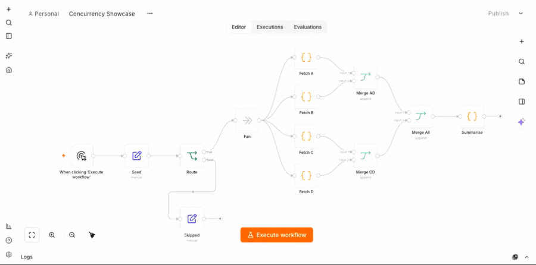
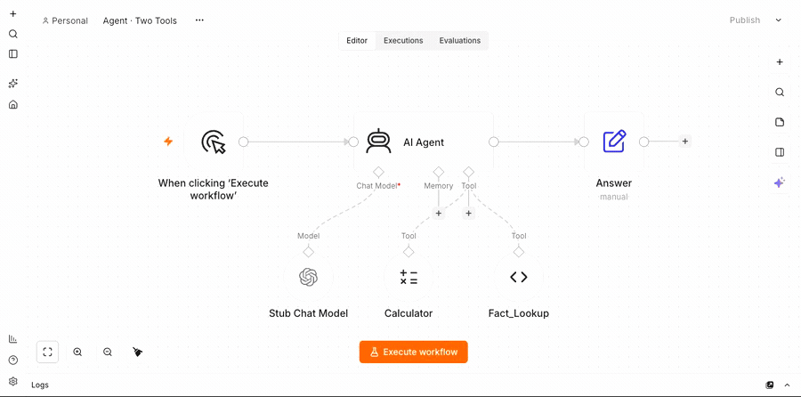
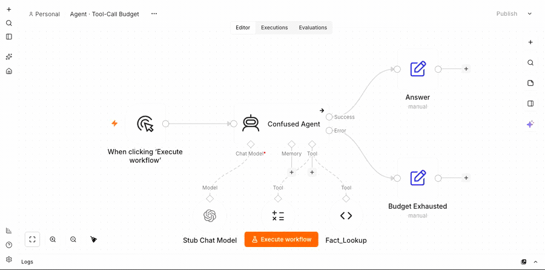
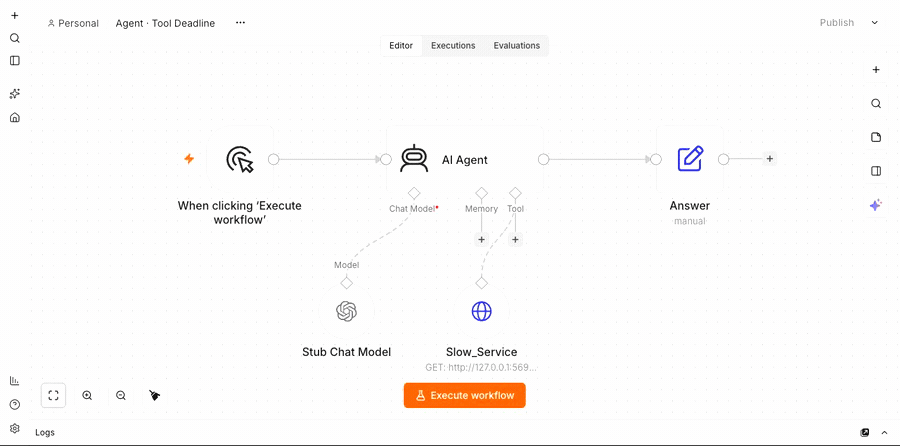
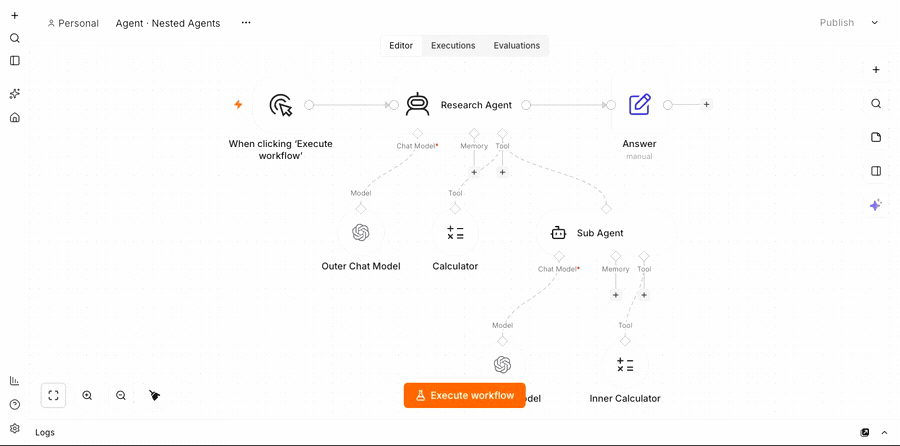
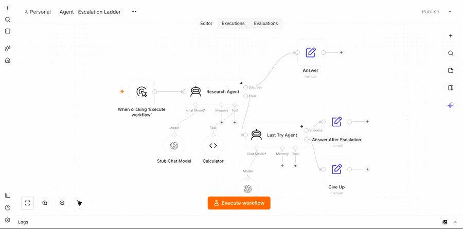
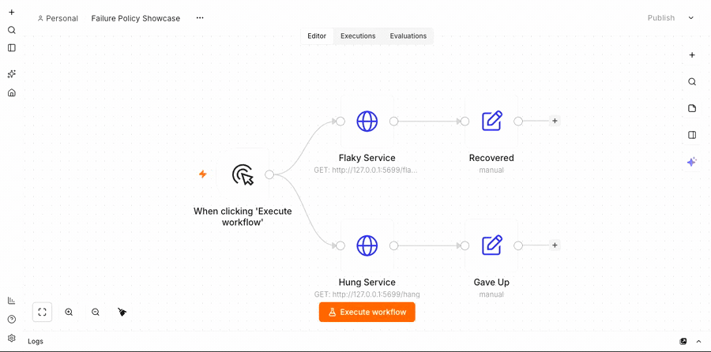
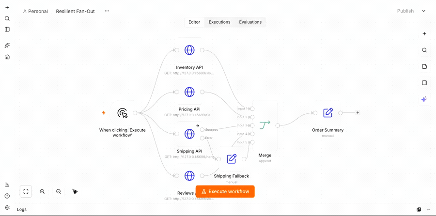

# The live testbed

Everything else in this repository measures the engine against `FakeHost`, a structural mirror of
patch 0001. It runs n8n's own execution-engine cases and diffs two schedulers against each other,
and it is deliberately not n8n: `docs/conformance-final.md` records the `cli` scope as
**registered, never entered**. The process n8n ships had never constructed the engine.

The testbed closes that gap. It boots the real `packages/cli` — editor, node types, task runner,
credentials, persistence — installs `PetriScheduler`, and seeds workflows so there is something
to press.

```bash
scripts/testbed/n8n-testbed.sh                 # libpetri, k = 4, http://127.0.0.1:5678
scripts/testbed/diff-engines.sh                # both engines, headless, compared
scripts/testbed/diff-engines-v2.sh             # engine v2 under four settlement modes, compared
scripts/testbed/browser-check.sh               # drive the editor, screenshot the canvas
```

## What it is, and what it is not

An **integration and demonstration harness**, not a conformance measurement. No number here
belongs in a headline: `scripts/run-conformance.sh` remains the authority on case counts, and
`CLAUDE.md`'s reporting rule applies to it rather than to this. What the testbed adds is evidence
of a different kind — that the seam holds in the process carrying n8n's own dependency injection,
module loading, credential decryption and task-runner IPC.

## How the engine gets in

n8n does not read `N8N_EXECUTION_ENGINE`; patch 0002 exposes `setWorkflowSchedulerFactory` and
nothing more, and an external process decides whether to call it. The conformance suite calls it
from a generated vitest `setupFiles` shim. A server has no such seam, so the testbed calls it
from an `--import` preload, `scripts/testbed/preload.mjs`:

```
node --import scripts/testbed/preload.mjs .n8n/packages/cli/bin/n8n start
```

Three details decide whether that works.

**`createRequire`, not `import`.** `packages/core` builds to CommonJS and `n8n-libpetri` is
ESM-only, so the preload resolves `n8n-core` and `n8n-workflow` through a `require` rooted at
`packages/cli/package.json`. Node resolves pnpm's symlinks to their realpath, so the registry
the preload writes to is the same CJS module instance `WorkflowExecute` later reads from.

**`--import`, not `NODE_OPTIONS`.** `bin/n8n` never re-execs, so a command-line preload covers
the process without entering the environment every child process inherits. (n8n's task runners would not get
`NODE_OPTIONS` either: n8n passes them an allowlisted environment.) The preload registers on the
main thread only, since worker threads inherit `--import` through `execArgv`.

**No fallback.** If any of that fails the preload throws and n8n does not start. A testbed that
quietly runs n8n's stack loop while reporting on the net is worse than one that refuses to boot.
Both directions are checked:

```
$ N8N_EXECUTION_ENGINE=legacy   node --import scripts/testbed/preload.mjs -e "0"
                                                     # inert, exits clean
$ N8N_EXECUTION_ENGINE=libpetri node --import scripts/testbed/preload.mjs -e "0"
Error: N8N_LIBPETRI_RESOLVE_FROM is not set          # refuses rather than degrades
```

### Two claims, two lines

The log carries them separately, because they are not the same statement:

```
[n8n-libpetri] scheduler registered: budget=4, loader=…/typescript/dist/index.js
[n8n-libpetri] engine entered: n8n constructed a scheduler through the registered factory
```

Registration is true at boot. **Entry** is `ENGINE_ENTERED_DIAGNOSTIC`, emitted by the factory
itself the first time n8n constructs a scheduler through it, and only an execution can
establish it. `docs/conformance-final.md` keeps the same distinction for the same reason.

### `packages/core` must be rebuilt

The server loads `packages/core/dist`, not `src`. A `dist` older than the patch runs an older
seam — and since M7, patch 0001 adds `planEngineRequest`, which the agent round calls. The
launcher rebuilds when `dist` is older than the patched source and then asserts both
`getWorkflowSchedulerFactory` and `planEngineRequest` are in the built file. The rebuild is
shared state with `scripts/run-conformance.sh --scope=cli`, whose own guard greps the same
built file; rebuilding from the patched source can only make that leg more correct.

## The ten workflows

All ten set `settings.executionOrder: "v1"`. Without it `PetriScheduler` delegates straight to
n8n's `StackScheduler` (divergence #3), and the testbed would be measuring n8n's own loop while
reporting on the net.

### Concurrency Showcase — 13 nodes

```
Manual Trigger → Seed → Route (If)
  false → Skipped
  true  → Fan → Fetch A | Fetch B | Fetch C | Fetch D     (Code, each sleeps 2.5 s)
Fetch A, Fetch B → Merge AB        Fetch C, Fetch D → Merge CD
Merge AB, Merge CD → Merge All → Summarise
```

Acyclic, with one producer per input index — which is what the k-safety check needs to leave
the budget alone. A cyclic SCC or a multi-producer index lowers the effective budget to 1, so
`Skipped` is a terminal node of its own rather than a second producer into `Merge All`: wiring
it there would have deleted the concurrency without saying so.

Every payload is deterministic. The legs return `{ leg: 'A' }` and not a timestamp, and
`Summarise` reports `{ legs: 4, order: 'A,B,C,D' }` — `append` concatenates input 0 then input 1
whatever order the branches finished in. The wall clock is measured from outside, so nothing
time-dependent has to travel through the data channel that the legacy/libpetri comparison reads.



*k = 4. Four legs hold a budget token each, so they start together.*

### Agent · Two Tools — 6 nodes

```
Manual Trigger → AI Agent (typeVersion 3.1, options.maxIterations 4) → Answer
Stub Chat Model  --ai_languageModel-->  AI Agent
Calculator       --ai_tool---------->   AI Agent
Fact_Lookup      --ai_tool---------->   AI Agent
```

`maxIterations` is the number the compiler seeds `A/rounds` from (ADR 0008 §2), which is what
makes the round cycle bounded. Two tools rather than one, because one exercises the round and
two exercise the **pending marker** — `A_dispatch` fires per call, `A/pending` counts them, and
`A_collect` closes the round when the last lands. Not the shared-tool shape: `agentSharedTool`
verifies as `violated` and it is a false alarm (`tasks/todo.md`).

The model is `scripts/testbed/stub-llm.mjs`, a local OpenAI-compatible server — no key, no
bill, no network, and a fixed script: the first call returns one `tool_calls` message naming
every tool the agent offered, the second returns a plain answer. Tool names and arguments are
read off the request's own `tools` array, so renaming a node cannot desynchronise the stub.

Two configuration details are load-bearing. n8n reaches the stub through the **credential's**
`url`, because `LmChatOpenAi` only validates `options.baseURL` and takes `credentials.url`
unguarded. And `responsesApiEnabled` defaults to **true** at typeVersion ≥ 1.3, so the workflow
turns it off explicitly; otherwise the node calls `POST /v1/responses` rather than chat
completions.



*One round, two outstanding calls. `Calculator` and `Fact_Lookup` are both dispatched before
either answers, and `A/pending` is what closes the round when the last one lands.*

### Agent · Tool-Call Budget — 7 nodes

```
Manual Trigger → Confused Agent (maxIterations 30) ─0→ Answer
                                                   └─1→ Budget Exhausted
Stub Chat Model  --ai_languageModel-->  Confused Agent
Calculator       --ai_tool---------->   Confused Agent
Fact_Lookup      --ai_tool---------->   Confused Agent
```

An agent that keeps asking. Its prompt carries the marker `[stub:loop]`, which makes
`stub-llm.mjs` answer **every** call with tool calls and never with `finish_reason: "stop"`: a
model that never decides it is done, made deterministic and offline. The marker travels in the
workflow's own prompt, so nothing outside the workflow arms it.

The agent declares:

```jsonc
"onError": "continueErrorOutput",
"executionPolicy": { "v": 1, "maxToolCalls": 6,
                     "onFailure": [ { "action": "route", "output": "error" } ] }
```

`onError` declares the *port* — `NodeHelpers.getNodeOutputs` appends the error output on that
field alone — and `onFailure` declares the *policy* that reaches it. This is the pair ADR 0009 §1
separates, in the one shape where the difference is visible: n8n has no tool-call budget to run
out of, so without the policy there would be nothing to route.

`maxIterations` is deliberately left at n8n's own default of 30, because the two bound different
things: it caps *rounds*, and a model may request any number of calls within one round.

**Measured, one manual leg each** (`n8n execute` through `scripts/testbed/run.mjs`; the legacy
leg came from `diff-engines.sh`, the net leg from a `--daemon` server at k = 4):

| leg | model calls | tool executions | how it ended | node status | wall |
|---|---|---|---|---|---|
| legacy | 30 | **60** | `Max iterations (30) reached` | `success` | 378 ms |
| libpetri k=4 | 4 | **6** | `Tool-call budget (6) reached` | `error` | 579 ms |

Both route the failure to `Budget Exhausted`, and both finish the execution as `success` — the
declared branch is taken either way. What differs is how much work it takes to get there:
**ten times the tool calls**, which against a real model rather than a local stub is ten times
the requests.

Two details worth stating rather than smoothing over:

- **The node statuses differ, and legitimately.** `checkMaxIterations` throws *inside* the
  agent's `Promise.allSettled` batch (`ToolsAgent/V3/helpers/executeBatch.ts:81`); under
  `continueOnFail` the rejection becomes a per-item `{ json: { error } }` on the success path,
  which is divergence #27's mechanism, so the node is `success` with an error item. Our budget is
  an engine-level failure raised before `runNode`, so it goes through
  `handleNodeExecutionError` and the node is `error`. Same destination, different cause.
- **The tools show 4 runs each, of which the 4th never executed** — divergence #29. n8n's
  `handleRequest` reserves a `runData` slot per requested action before anything runs; the net
  then declines to dispatch the two the budget cannot pay for, and the reservation stays behind
  with `startTime: 0`.

`tests/scheduler/agent.test.ts` pins the same mechanism against `FakeHost`, deterministically
and without a server.



*The model never says stop. What stops it is the budget: `Confused Agent` ends red, `Budget
Exhausted` runs off its error output, and `Answer` stays grey.*

### Agent · Tool Deadline — 5 nodes

```
Manual Trigger → AI Agent (maxIterations 3) → Answer
Stub Chat Model  --ai_languageModel-->  AI Agent
Slow_Service     --ai_tool---------->   AI Agent      (HTTP Request Tool -> stub /hang)
```

The policy is on the **tool**, which is the node that actually calls the service:

```jsonc
"executionPolicy": { "v": 1, "timeoutMs": 3000, "onFailure": [ { "action": "continue" } ] }
```

`/hang` never answers and the socket is deliberately left open — [IO-013] is explicit that
abandoning a firing is a capability, not a guarantee, and this is where that shows. The workflow
sets `settings.executionTimeout: 20`, because n8n's whole-execution timeout is the *only* bound
it has here: there is no per-tool deadline at any level, and `maxIterations` does not help, since
the agent never gets as far as a second iteration.

Only three of the four actions mean anything on a tool. A tool's outcome is its agent's
`A/response`, not a main edge, so `route` has nowhere to go and the compiler refuses it by name.
`continue` is n8n's own default for a failing tool: it continues an `ai_tool` node so the agent
receives the error as its tool response (`workflow-execute.ts`). `retry` and `stop` behave as
they do anywhere else.

**Measured, one leg each:**

| leg | `Slow_Service` | `AI Agent` | execution | wall |
|---|---|---|---|---|
| legacy | never completes, status unset | never recorded | **canceled**, `finished: false` | **20,083 ms** |
| libpetri k=4 | `error` — *"Attempt 1 of \"Slow_Service\" did not finish within 3000 ms and was abandoned"* | `success` | **success** | **3,592 ms** |

Same workflow, same hung service, two bounds at different scopes. n8n's applies to the whole
execution, so it ends the whole execution; the per-tool deadline loses the tool call and nothing else — the agent receives the
error as its tool response, answers, and `Answer` runs. `tests/scheduler/agent.test.ts` pins the
same four behaviours against `FakeHost` without a server.



*`Slow_Service` goes red at its 3 s deadline. The agent receives the error as its tool response and `Answer` still runs.*

### Agent · Nested Agents — 8 nodes

```
Manual Trigger → Research Agent → Answer
                   ai_tool ↑ Calculator
                   ai_tool ↑ Sub Agent  (@n8n/n8n-nodes-langchain.agentTool)
                                ai_tool ↑ Inner Calculator
```

`Sub Agent` is n8n's `AgentToolV3`: an agent wired as another agent's tool. Its description is
`outputs: [NodeConnectionTypes.AiTool]` with every input `ai_*`, and its body is
`toolsAgentExecute` — the same executor the top-level `Agent` runs — so it emits an
`EngineRequest` for *its* tools exactly as a top-level agent does. After the adapter filters
inputs to `main`, its shape is a plain tool's, which the generated catalogue confirms
(`@n8n/n8n-nodes-langchain.agentTool@3` → `{inputCount: 0, outputCount: 0}`).

That makes it the one node in the model that is a **tool and an agent at once**, and nothing in
the gadget was written for the combination: `joinFormOf` returns `'tool'` for `isTool`, while the
whole round block is added for `tools.length > 0`. They compose. `Sub Agent` gets a tool's input
side (`B/in_tool`, and none of `in` / `in_empty` / `skipped`) and an agent's round entire, and
the two meet in one `X_run` `xor` — the tool branch writes the parent's `A/response`, the request
branch writes its own `B/routed_req`. The branches are disjoint, which is what IO-015's
exact-explanation search needs. `tests/compiler/agent.test.ts` pins the place and transition sets
by hand rather than by a recorded count.

| leg | status | wall clock | data vs reference |
| --- | --- | --- | --- |
| legacy (reference) | success | 939 ms | — |
| libpetri k=1 | success | 922 ms | **identical** |
| libpetri k=4 | success | **585 ms** | **identical** |

Both tools are Code tools that sleep 400 ms, which is about what a real one costs and is what
makes the round legible in the clip below. It also makes the leg measurable: with instant tools
all three numbers sat within 5% and said nothing about either engine.

What the numbers say now is where the round's calls sit relative to each other:

```
legacy:       … → Outer Chat Model#0 → Inner Chat Model#0 → Inner Calculator#0 → Sub Agent#0 → Inner Chat Model#1 → Calculator#0 → …
libpetri k=1: … → Outer Chat Model#0 → Inner Chat Model#0 → Calculator#0 → Inner Calculator#0 → Sub Agent#0 → Inner Chat Model#1 → …
libpetri k=4: … → Outer Chat Model#0 → Calculator#0 → Inner Chat Model#0 → Inner Calculator#0 → Sub Agent#0 → Inner Chat Model#1 → …
```

`Calculator` is the *outer* agent's other tool, requested in the same round as `Sub Agent`. n8n
runs the round's calls one after another, so `Calculator` waits out the entire inner agent. The
net holds only the ordering the data forces: at k=1 it takes the first slot that frees, and at
k=4 it runs while the inner agent is still working, which is the 585 ms. Nothing downstream
depends on which, and the data is identical on every leg — which is the distinction the differ
draws between a reordering and a difference. Both happens-before edges hold throughout.

The two runtimes bound delegation differently. n8n's newer agent runtime identifies a delegated
task by a path string and accepts one level below the root, so a second level of delegation is
rejected when that path is parsed rather than by a check written for the purpose. Here the depth is
the graph, and the bound is a marking at every level: each agent spends its own `A/calls`,
nothing refunds either, and z3 validates one conservation law spanning both rounds. An inner
agent that exhausts its budget fails by name *inside itself*, and n8n's own rule for a failing
`ai_tool` node hands that error to the agent above as an ordinary tool response — so a runaway
at depth 2 is contained at depth 2 and the execution still completes
(`tests/scheduler/agent.test.ts`).

The cost is real and is stated rather than hidden. Two nested agents close in 19,523 state
classes at `maxToolCalls` 2 and 202,164 at 3; at 4 the solver-free route runs out of heap before
it closes (`effectiveMaxClasses` clamps to what the heap affords — 263,737 on this machine). The
SMT route still answers past that point, which is what it is for.



*Depth 2. `Sub Agent` is an agent wired as a tool, with a tool of its own.*

### Waiting Child + Parent Waits On Child — 3 nodes each

```
Parent:  Manual Trigger → Call The Child (Execute Workflow) → Parent Result
Child:   Execute Workflow Trigger → Wait 70s → Child Result
```

The parent cannot know the child's id before the child is seeded, so it carries
`__WORKFLOW_ID:Waiting Child__` and `seed.mjs` binds it — the same rule as the stub's port and
the credential: nothing under `workflows/` hardcodes instance state.

**70 seconds is the point, not an accident.** n8n's Wait node has a threshold a little over a
minute. A shorter wait is held in process on a timer; only a longer one suspends the execution and
writes a `waitTill`. The threshold applies to the computed remaining wait, so it governs both the
interval and the fixed-time forms.

Under it n8n **holds the execution active**; over it, n8n suspends. Measured both ways, with the
node's own `executionTime` telling them apart:

| child waits | `Call The Child` executionTime | what happened |
|---|---|---|
| 4 s | **4,036 ms** | the node was held for the whole wait; nothing suspended |
| 70 s | **0 ms** | the node suspended, the marking was written, and it re-ran on resume |

At 70 s the parent suspends on `putExecutionToWait(WAIT_INDEFINITELY)`
(`base-execute-context.ts:193`), n8n's `WaitTracker.resumeParentExecution` wakes it once the
child finishes, and the child's output crosses the boundary intact.

**Both engines, 70 s child:** legacy 70,161 ms, libpetri 70,143 ms, **data equal**, every payload
identical. This leg is parity: n8n handles nested waits correctly and so does the net. What it
establishes is that a suspended parent survives the marking round trip in a real server, which
every resume claim rests on.

The sub-cliff case is where the two differ: a node held by `setTimeout` holds its
`_budget` unit for the entire wait, and `executionPolicy.timeoutMs` is the only thing in either
engine that can bound it (see **Agent · Tool Deadline**). n8n has a second cliff of the same
shape in its agent bridge — `WAIT_POLL_ELIGIBLE_MS = 60_000`, under which it polls the database
every two seconds and over which it asks a human to press a button.

### Agent · Escalation Ladder — 9 nodes

```
Manual Trigger → Research Agent ─0→ Answer
                  (maxToolCalls 2) └─1→ Last Try Agent ─0→ Answer After Escalation
                                        (maxToolCalls 1)  └─1→ Give Up
Stub Chat Model      --ai_languageModel--> Research Agent
Calculator           --ai_tool----------->  Research Agent
Last Try Chat Model  --ai_languageModel--> Last Try Agent
```

An escalation written as graph rather than as a branch inside a node. The first agent carries
`[stub:loop]`, so it never finishes on its own. Its declared budget is two, and the `onFailure`
step routes the exhaustion to its error output instead of ending the execution. That output feeds
a *second* agent with a different instruction — "you have one attempt left, answer from what you
already know" — whose own error output is the give-up path.

`Calculator` is a Code tool that sleeps 400 ms before answering, which is roughly what a real one
costs. An instant tool would put the whole round in one frame.

Measured, one run: `Calculator` ran twice, `Research Agent` ended `error` with
`Tool-call budget (2) reached`, `Last Try Agent` answered without calling a tool, and `Give Up`
never ran. 566 ms with the stub answering instantly; 6.2 s with `--llm-latency=1300`, which is
what the clip above shows — three model calls of about 1.3 s, two tool calls of about 0.4 s.

The point is where the escalation lives. No node asks "is this the last try"; the budget is a
place, the second agent is reached only when that place is empty, and the give-up path is an
edge nothing takes until the one above it is spent. Each of the three outcomes is a different
region of the graph, so each is something the verifier can reason about.



*`Research Agent` spends its budget of two and routes the exhaustion down its error output.
`Answer` and `Give Up` stay grey because neither path was taken. Recorded with `--llm-latency=1300`
so the round has beats.*

### Failure Policy Showcase — 5 nodes

Two branches off the trigger, each calling the testbed's own stub over HTTP:

```
Trigger ─┬─ Flaky Service (/flaky?fail=2) ── Recovered
         └─ Hung Service  (/hang)         ── Gave Up
```

`Flaky Service` returns 503 twice for a given key and then 200, so the failure is a real non-2xx
and a real n8n node error rather than a `throw` in a Code node. `Hung Service` never answers.
Neither node sets `retryOnFail` or `onError`; each carries an `executionPolicy` (ADR 0009):

```jsonc
"Flaky Service": { "v": 1, "onFailure": [
  { "action": "retry", "waitMs": 250 }, { "action": "retry", "waitMs": 1000 }, { "action": "stop" } ] }

"Hung Service":  { "v": 1, "timeoutMs": 1500, "onFailure": [
  { "action": "retry", "waitMs": 0 }, { "action": "continue" } ] }
```

The stub keys `/flaky` on `$execution.id`, so every run starts from a fresh failure count.



*Two branches, two declared chains. `Flaky Service` retries on its own delays and recovers;
`Hung Service` is abandoned at 1.5 s, `continue` carries the branch on, and the run finishes.*

### Resilient Fan-Out — 7 nodes

Both halves together: concurrency and resilience, declared in the workflow rather than arranged
by the engine's configuration.

```
Trigger ─┬─ Inventory API (/slow?ms=3000) ─┐
         ├─ Pricing API   (/flaky?fail=2)  ├─ Merge (4 inputs) ── Order Summary
         ├─ Shipping API  (/hang)          │
         └─ Reviews API   (/slow?ms=3000) ─┘
```

Four independent branches, so the budget has something to spend. Two are healthy and slow, one
fails twice before recovering, one never answers. The two that need a policy declare one:

```jsonc
"Pricing API":  { "v": 1, "onFailure": [
  { "action": "retry", "waitMs": 400 }, { "action": "retry", "waitMs": 800 }, { "action": "stop" } ] }

"Shipping API": { "v": 1, "timeoutMs": 2500, "onFailure": [
  { "action": "retry", "waitMs": 0 }, { "action": "continue" } ] }
```

Every node is an ordinary `n8n-nodes-base.httpRequest` against the testbed's own stub, and the
Merge is n8n's own. Nothing here is a Petri net concept: the workflow reads as a workflow.



*Four branches at once. `Pricing API` retries, `Shipping API` is abandoned at its deadline, and `Merge` still runs.*

## What was measured

n8n 2.37.0 at the pin `441970b2`, Node 26.8.1, macOS, k as shown, best of two runs per leg,
2026-09-11. `diff-engines.sh` produced this, over the three workflows both engines finish the
same way — which is what `--workflows` defaults to. The rest of the seed exists to show a
*difference*, so a leg-against-leg diff of those would compare two intended outcomes.

| Workflow | leg | wall clock | data vs n8n | happens-before | order |
| --- | --- | --- | --- | --- | --- |
| Concurrency Showcase | legacy (reference) | 10,166 ms | — | 14 edges ok | — |
| | libpetri k = 1 | 10,172 ms | identical | 14 edges ok | same |
| | libpetri k = 4 | **2672 ms** | identical | 14 edges ok | **reordered** |
| Agent · Two Tools | legacy (reference) | 129 ms | — | 2 edges ok | — |
| | libpetri k = 1 | 129 ms | identical | 2 edges ok | same |
| | libpetri k = 4 | 130 ms | identical | 2 edges ok | same |
| Agent · Nested Agents | legacy (reference) | 939 ms | — | 2 edges ok | — |
| | libpetri k = 1 | 922 ms | identical | 2 edges ok | **reordered** |
| | libpetri k = 4 | **585 ms** | identical | 2 edges ok | **reordered** |

Four independent 2.5 s legs, so 10 s sequentially and 2.5 s four-wide: the net returns 2672 ms
against n8n's 10,166 ms, and costs nothing measurable at k = 1 — 10,172 ms, six milliseconds
apart over ten seconds. The reorder is the whole difference —

```
n8n            … Fan → Fetch A → Fetch B → Merge AB → Fetch C → Fetch D → Merge CD → …
libpetri k = 4 … Fan → Fetch A → Fetch B → Fetch C  → Fetch D → Merge AB → Merge CD → …
```

n8n enqueues `Merge AB` as soon as its two inputs have arrived and runs it before it starts
`Fetch C`; the net starts all four legs, because nothing orders them. Every node still runs
exactly once with the same payload, and every realised dependency edge is still respected.

### How each column is decided

The three are kept apart on purpose, because the claim is that **the data is identical and the
order is not** — folding them into one verdict would report the feature as a failure.

- **Data** compares each node's `ITaskData` field by field, minus `startTime`, `executionTime`
  and `executionIndex`. That field list mirrors `comparableTask` in `src/conformance/differ.ts`,
  which leaves the same three out for the same reason: they are clocks and positions, not data.
- **Happens-before** takes `dependencyEdges` from the same module — the *realised* dependency
  graph, read off the `source` n8n stamps on every task — and checks each edge inside each leg.
  The observation is n8n's own per-task clock, since a live server produces no `runNode` trace;
  an edge holds when the producer's `startTime + executionTime` is at or before the consumer's
  `startTime`. Independent activations are free to be unordered: that is the concurrency.
- **Order** is `executionOrder` over n8n's own `executionIndex`. Reported, never asserted.

### The failure policy, both engines

Run through the same manual-execution endpoint, 2026-09-10, k = 4:

| leg | outcome | wall | Flaky Service | Hung Service | downstream |
| --- | --- | ---: | --- | --- | --- |
| legacy (n8n's own loop) | **error** | 70 ms | `error` on the first 503 | never reached | neither ran |
| libpetri, chain declared | **success** | 3,086 ms | `success` after 3 calls | `error` after 2 × 1,500 ms | both ran |

Three things this leg is for, none of which a unit test can show:

- **The carrier survives the real stack.** The policy goes in through the same
  `POST /rest/workflows` the editor uses and comes back out of the database byte-for-byte. That
  is the claim ADR 0009 §2 rests on, and the types alone cannot establish it.
- **The deadline ends a hang.** A service that never answers costs 3 s and a recorded error
  instead of holding the node until n8n's whole-execution timeout. The socket stays open — IO-013
  is explicit that abandoned work is not cancelled — and the run finishes anyway.
- **The layering test passes.** n8n's own scheduler ran the *same document* without complaint,
  ignoring a key it does not know. A workflow carrying an execution policy stays meaningful under
  the engine that cannot honour it, which is what makes the carrier an interface rather than a
  leak.

The legacy row is not "n8n cannot retry": `retryOnFail` would have recovered the flaky branch.
It is that the declared policy is ignored, and that n8n has no per-attempt delay and no per-node
deadline to declare in the first place.

### Resilient Fan-Out, three legs

Same workflow, same stub, through the manual-execution endpoint, 2026-09-10:

| leg | outcome | wall | what happened |
| --- | --- | ---: | --- |
| legacy (n8n's own loop) | **error** | 3,106 ms | Inventory ran, Pricing hit its first 503, the execution stopped. Shipping, Reviews and Merge never ran |
| libpetri k = 1 | **success** | 12,654 ms | every branch answered, one after another |
| libpetri k = 4 | **success** | **5,123 ms** | every branch answered, all four in flight |

The k = 4 timeline, from n8n's own per-task clock:

| node | status | started | took |
| --- | --- | ---: | ---: |
| Trigger | success | +0 ms | 1 ms |
| Pricing API | success | +2 ms | 1,258 ms |
| Inventory API | success | +2 ms | 3,014 ms |
| Reviews API | success | +2 ms | 3,015 ms |
| Shipping API | **error** | +2 ms | 5,057 ms |
| Merge | success | +5,060 ms | 2 ms |
| Order Summary | success | +5,062 ms | 1 ms |

All four branches start within **2 ms** of each other, and the run is bounded by the slowest of
them rather than by their sum — 5,123 ms against 12,654 ms sequential, a 2.5× cut on a workflow
whose JSON asks for no concurrency at all. The budget is a launcher flag; the document is the same
one the legacy leg ran. Pricing's 1,258 ms is three calls with 400 ms and
800 ms between them; Shipping's 5,057 ms is two attempts abandoned at their 2.5 s deadline,
after which `continue` let the branch carry a payload into the Merge and the workflow finish.
The legacy leg is the same document under the engine that ignores the policy.

### Reading the canvas: why the Error arc is grey

Shipping API's Error arc is labelled **1 item** and drawn **grey**. Both are correct; they answer
different questions. Worth knowing before anyone films it and worries.

The label comes from `runDataTotal` on the connection. The stroke comes from the *source node's*
status, through four steps in n8n's own editor:

1. `handleNodeExecutionError` sets `taskData.executionStatus = 'error'` unconditionally, even for
   a failure it then continues past. Shipping API really did fail, twice.
2. `computeHasIssues(nodeId)` returns true for `'error'` or `'crashed'`
   (`useWorkflowDocumentRenderData.ts`).
3. `getConnectionStatus` matches `error: hasIssuesByNodeId.get(connection.source)`, and
   `CONNECTION_STATUS_PRIORITY = ['running', 'pinned', 'error', 'success']` — **`error` outranks
   `success`**, so the arc is `error` even though `success` matched too
   (`useCanvasMapping.ts`).
4. `CanvasEdge.vue` colours only `success` and `pinned`; everything else falls through to grey.

So **grey means "the source node has issues", not "no data flowed"**, which is why *both* of
Shipping API's arcs are grey, the Success one included. This is n8n's rendering rather than the
engine's: in the ordinary n8n case an error-output arc is green, because the node emitted per-item
errors and kept its own `success` status, so `hasIssues` is false and `success` wins. A whole-node
failure is red, and a red node's arcs are grey.

Making it green would mean stamping the node `executionStatus: 'success'` — untrue, and it would
remove the red badge that is the point of the frame.

### Recording a run

```bash
scripts/testbed/record-demo.sh                       # Resilient Fan-Out at k = 4
scripts/testbed/record-demo.sh --workflow="Agent · Two Tools" --budget=1
```

Video: `.testbed/video/<workflow>-<engine>-k<budget>.webm`, continuous at 10 fps.

`--llm-latency=MS` makes the stub answer at a real model's pace, and every agent clip here is
recorded at 1300 ms. It is what makes a round legible: the model thinks, a tool runs, the model
thinks again. With the stub answering instantly the three land in one frame. The tools sleep for
the same reason — the escalation ladder's `Calculator` and both of the nested workflow's are Code
tools that wait 400 ms, which is about what a real one costs.

Latency is **zero by default**, because every wall clock this document reports is measured with
the stub answering instantly and a pause would put itself into those numbers. It changes no
outcome: the same nodes run, in the same order, with the same data.

`scripts/testbed/make-gifs.sh` converts the recordings to the GIFs this document embeds — GitHub
sanitises `<video>` out of Markdown, so a committed WebM would render as a download link. The
recording ends on 1.5 s of the finished canvas and the GIF holds that frame for 1.5 s more,
because a GIF loops without pausing and the result would otherwise be gone before it can be read.

Three things the script has to get right.

**It records with `agent-browser record`, which opens its own browser context.** That context
carries none of this machine's cookies, so it lands on the sign-in page. The sign-in therefore
happens inside the recording and the front of the file is trimmed afterwards — re-encoded rather
than stream-copied, since a copy can only cut on a keyframe and at 10 fps that rounds the cut to
somewhere unhelpful. An earlier version assembled PNG screenshots at 2 fps, believing the
screencast was change-driven; it is not.

**It frames the canvas** by clicking n8n's own Zoom to Fit control, after a fresh snapshot. Refs
go stale across a navigation, and the keyboard shortcut only lands when focus is already on the
canvas pane, which after a page load it is not. Without this the recording is whatever pan the
editor restored, with the first node half under the sidebar.

**It sends no keystrokes to the canvas.** n8n saves a workflow before a manual execute, so an
editing keystroke from the recorder is written back into the fixture. One earlier attempt at the
zoom added a sticky note that way.

Completion comes from n8n's REST API rather than from the DOM, because the success toast
auto-dismisses and `get text` does not reliably carry it.

## Queue mode: the engine in the worker

```bash
redis-server --port 6399 --save '' --appendonly no --daemonize yes
scripts/testbed/n8n-testbed.sh --queue --daemon
```

Everything above runs n8n in `regular` mode, where one process both serves the editor and
executes. Production usually does not: `EXECUTIONS_MODE=queue` makes `n8n start` a producer that
puts a job on Redis, and a separate `n8n worker` process consumes it. **That is where the engine
has to be**, because in queue mode the main process never constructs a scheduler for a queued
execution — `WorkflowExecute.processRunExecutionData()` is called in the worker, at
`packages/cli/src/scaling/job-processor.ts`.

So the worker gets the same `--import` preload the main process gets, and the launcher refuses
to continue if the worker's log does not carry `scheduler registered`. A worker without it would
run n8n's own stack loop while the main process's log still said the engine was installed — the
failure the preload's "no fallback" rule exists to prevent, one process over.

Three things had to be true, and each was found by hitting it:

1. **The worker needs its own task-broker port.** Every n8n process starts an internal broker on
   `N8N_RUNNERS_BROKER_PORT`, default 5679, and the main process already has it — the worker
   exits with *"n8n Task Broker's port 5679 is already in use"*. The launcher gives it
   `--port + 2`.
2. **A manual execution is not enqueued at all.** `workflow-runner.ts` enqueues only when
   `mode === 'queue' && executionMode !== 'manual'`, unless
   `OFFLOAD_MANUAL_EXECUTIONS_TO_WORKERS=true`. Everything the testbed drives is a manual
   execution, so without that flag the main process runs the workflow in-process and the worker
   sits idle — a leg that would have measured `regular` mode while calling itself queue mode.
   The first run of this did exactly that: `engine entered` appeared in the *main* log and the
   worker log had none.
3. **Redis carries a pointer, not the marking.** The job payload is `{ executionId, … }`
   (`scaling.types.ts`); the worker loads `execution.data` — the whole `IRunExecutionData`, our
   marking included — from the **database**. So queue mode changes the process topology and
   nothing about the path ADR 0005 depends on, and *"n8n stays the system of record"* holds
   unchanged.

### What it proves

Every activation ran in the worker: `engine entered` appears **once in the worker log and zero
times in the main log** across the whole run. The main log shows only `Enqueued execution N
(job M)`.

The resume is the part worth having:

```
Worker started execution 136 (job 6)     Parent Waits On Child, runs to the Wait, suspends
Worker started execution 137 (job 7)     Waiting Child, its own 70 s Wait, suspends
Worker started execution 136 (job 8)     the same execution, a different job — resumed
```

Execution 136 appears twice under **two different job ids**. The marking the codec wrote in job
6 was persisted, re-enqueued when the wait elapsed, and read back by job 8, which completed the
execution. That is the marking round trip through Redis and the database rather than through one
process's memory — and it is the claim every resume in this project rests on.

| workflow | regular k=4 | queue k=4 | data |
| --- | --- | --- | --- |
| Concurrency Showcase | 1,346 ms | 1,293 ms | **identical** |
| Agent · Two Tools | 514 ms | 580 ms | **identical** |
| Agent · Nested Agents | 134 ms | 133 ms | **identical** |
| Resilient Fan-Out | 5,091 ms | 5,255 ms | **identical** |
| Parent Waits On Child | 70,145 ms | 70,306 ms | identical but for the child's execution id |

Same order on every one, and every happens-before edge holds. The last row's only difference is
`runData['Call The Child'][0].metadata.subExecution.executionId` — the child execution's database
id, which two runs cannot share; comparing the two `runData` trees with database ids and
timestamps excluded gives **zero** differences. **This is parity, not an advantage**, and the
wall clocks are not a result either: the two legs are within noise of each other, which is what
you would expect when the work is the same and only the process boundary moved.

### The caveat

n8n logs *"Scaling mode is not officially supported with sqlite. Please use PostgreSQL
instead."* and continues. The testbed keeps sqlite, because the claim being made here is about
where the engine runs and what survives the round trip, not about database concurrency — but a
queue-mode leg on sqlite is n8n running outside its supported configuration, and no number from
it should be read as a statement about queue mode under load. A Postgres leg is the honest way
to make that stronger claim and has not been run.

## How a waiting sub-workflow reaches an agent

```bash
N8N_ENABLED_MODULES=agents scripts/testbed/n8n-testbed.sh --daemon
```

`scripts/testbed/n8n-testbed.sh` with `N8N_ENABLED_MODULES=agents` boots n8n's **new** agent
runtime (`packages/cli/src/modules/agents`, not a default module). Its agents are created over
REST at `/rest/projects/:projectId/agents/v2`, their model is `provider/model` with an ordinary
n8n credential, and `openai: (c) => ({ apiKey: c.apiKey, baseURL: c.url })`
(`json-config/credential-field-mapping.ts:18`) means the testbed's existing stub-OpenAI
credential drives it unchanged. So `stub-llm.mjs` can drive `@n8n/agents`, which was the open
question.

What that buys is a measurement of **their** half of the wait problem: an agent calls a
sub-workflow as a tool, and the sub-workflow waits. Two constants decide what happens, and they
are in different packages:

| constant | value | where |
| --- | --- | --- |
| the Wait node's hold-vs-suspend threshold | `65000` | `nodes-base/nodes/Wait/Wait.node.ts:596` |
| the agent tool's poll-vs-human threshold | `WAIT_POLL_ELIGIBLE_MS = 60_000` | `cli/src/modules/agents/tools/workflow-tool-factory.ts` |

`isPollableWait` is `waitTill - now <= 60_000` (`:784`). The Wait node computes `waitTill` and
then, if the remaining wait is under 65 s, blocks in-process on a `setTimeout` and never suspends
at all — for `timeInterval` and `specificTime` alike, since the check is on the computed
`waitValue`. **The two thresholds therefore do not overlap**: under 65 s there is no `waiting` execution
for the agent to poll, and at 65 s or more the `waitTill` is already further out than 60 s.

Measured, both sides, one agent with one workflow tool re-pointed between runs:

| child waits | what the agent's turn did | elapsed |
| --- | --- | --- |
| 30 s | `tool-execution-start` → `tool-execution-end`, `status: "success"`, real output | **blocked 30.1 s** |
| 70 s | `tool-call-suspended`, a `workflow_wait` card | **0.7 s** |

The 30 s tool call held the agent's turn open for the whole thirty seconds and then returned
`{"Child Result":[{"childSaid":"the child woke up and finished"}]}` — no suspension, no polling,
because the Wait node never let the execution reach `waiting`. The 70 s call suspended in under a
second and handed back a card titled `Waiting on "Waiting Child"` with two buttons,
**"Check for the result"** and **"Stop waiting"** (`buildWaitCard`, `:823`). A human has to press
one.

The poll window therefore does not apply to a Wait node. It is reached where
something else sets a short `waitTill` — `Form` and the `sendAndWait` operations through
`configureWaitTillDate`, whose default is `WAIT_INDEFINITELY` and whose `limitWaitTime` would
have to be set under a minute. That is a human-approval *timeout*, not work finishing.

This is the default configuration rather than a corner: `backgroundTasksEnabled` defaults to `false`
(`@n8n/config/src/configs/agents.config.ts`), so the background-job path between the two is
off, and `supportsHitl` defaults to `true` (`workflow-tool-factory.ts`).

### The same case under the net

A waiting sub-workflow is a **marking**. The parent's `Call The Child` records
`executionTime: 0 ms`, the marking is written to `IRunExecutionData`, and the execution resumes
when the wait elapses — 70,143 ms end to end against legacy's 70,161 ms, every payload identical
(*Waiting Child + Parent Waits On Child* above). In queue mode the same execution came back as a
**different job id** and completed there (*Queue mode* above), so the marking survives a process
boundary as well as a suspension.

Nothing blocks and nobody is asked to act. Both of n8n's behaviours are reasonable ones —
blocking a chat turn for thirty seconds is a fair trade, and asking a person about a wait
measured in hours is often the right call. Keeping the wait as a marking is a third option, and
it is available here because the scheduling state is data rather than control flow.

**Be precise about what was compared.** These are two different integration points — n8n's agent
tool in `modules/agents`, and our classic `Execute Workflow` node under the net. The question
they answer is the same ("an agent's sub-workflow waits, now what") but the mechanisms are not,
and no number in one table belongs in the other.

## Engine v2: the settlement policy in the live server

```bash
scripts/testbed/n8n-testbed.sh --v2 --settlement=primary   # the net-backed policy answers
scripts/testbed/n8n-testbed.sh --v2 --settlement=shadow    # n8n answers; ours runs beside it
scripts/testbed/n8n-testbed.sh --v2 --settlement=off       # patched, nothing registered
scripts/testbed/n8n-testbed.sh --stop                      # stops either testbed and the Postgres
```

Everything above is engine v1. `--v2` boots n8n's engine v2 (`N8N_ENABLED_MODULES=engine-v2`,
`N8N_ENGINE_MODE=in-process`) with the net-backed `SettlementPolicy` of patches 0003/0004
(`tasks/v2-seam-plan.md`, step 11). The engine's data plane needs Postgres
(`N8N_ENGINE_DATABASE_URL`); `scripts/testbed/pg.sh` starts one in Docker, on
`postgres:18.4-alpine` (the image the engine's own integration tests use), on 127.0.0.1:55432,
capped at 384 MB. `LIBPETRI_PG_URL` replaces it with a server you run. n8n's **main** database
stays the testbed's sqlite file: nothing in the engine-v2 module needs Postgres there. The state is
`.testbed/v2/`, apart from the v1 testbed's, because a seeded `engineType: "v2"` would route the v1
testbed's runs to a module that is not loaded.

**How the policy gets in.** The same preload, a second branch, with the same three rules. It
resolves `@n8n/engine` through `createRequire(packages/cli/package.json)`, so it reaches the CJS
instance whose registry `createEngineRuntime` reads (patch 0004). It refuses to boot when that
module has no `setSettlementPolicy`, in every mode, `off` included. It runs on the main thread only:
`--import` also runs in worker threads, which n8n starts after boot, and there the registration
would land on a second engine instance and print a second, false `registered`. The launcher
rebuilds `packages/@n8n/engine/dist` when a source file is newer than the last build, and checks
the built engine carries the seam.

**The gate.** The launcher refuses to continue unless the log has the preload's
`settlement policy registered: mode=…`, or `settlement policy off` for `off`, and
`Engine v2 listening on …`. Entry is a separate line, written by the policy the first time a
settlement in an execution calls it: `settlement policy entered: method=…, execution=…`. Every
diagnostic and every shadow report is also appended to `.testbed/v2/settlement.jsonl`, and the
Postgres provenance is in `.testbed/v2/pg-stamp.txt`.

**What is seeded.** Every testbed workflow engine v2 can start, with `settings.engineType: "v2"`,
plus three v2-only workflows. "Can start" is checked with n8n's own code: `V1WorkflowConverter`
(what `EngineV2Dispatcher` calls) and `validateExecutableGraph` (what `StartExecutionService`
calls). A workflow either refuses is skipped, and the reason goes into `ids.json`. Each workflow
is read back after the write, so a REST path that dropped `engineType` would fail the seed.

| workflow | engine v2 |
|---|---|
| Agent · Tool-Call Budget, Agent · Escalation Ladder, Resilient Fan-Out | skipped: the converter refuses `onError: continueErrorOutput` |
| OR Round Overflow | skipped: `validateExecutableGraph` refuses two edges into one input slot |
| Concurrency Showcase | seeded; fails at its first Code node ("Task runners (Code node) is not supported on Engine v2 yet") |
| Agent · Two Tools, Agent · Nested Agents, Agent · Tool Deadline | seeded; fail at the agent ("A Chat Model sub-node must be connected and enabled") |
| Parent Waits On Child | seeded; fails at Execute Workflow ("Sub-workflows (executeWorkflow) is not supported on Engine v2 yet") |
| Waiting Child | seeded; started only by its parent |
| Failure Policy Showcase | seeded; fails at the first 503, because engine v2 does not read `executionPolicy` |
| **V2 Loop Over Items** | Loop Over Items over 1,000 items at batch size 1: 1,001 batch passes |
| **V2 If Switch Diamond** | If, then a Switch on its true branch, into a three-input Merge |
| **V2 Stop And Error Sibling** | Stop and Error beside a sibling chain held 1.5 s by the stub's `/slow` |
| **V2 Wide Fan-Out** | six chains of four Set nodes, six sinks: 25 settlements, with other chains' steps queued while one chain's settlement is handled |
| **V2 Webhook Last Node** | production webhook, `responseMode: lastNode` (engine v2's `runEnd`); Split Out, If, Merge, one sink |
| **V2 Webhook Two Sinks** | production webhook, `lastNode`; two sinks fed by one node, so the body names the sink whose settlement ended the run |
| **V2 Webhook Respond Node** | production webhook, `responseMode: responseNode` (`stepResponse`); Respond to Webhook answers 201 with a header, and one node runs after it |
| **V2 Webhook Fails** | production webhook, `lastNode`, on a run that ends at a Stop and Error |

The v2-only workflows (`scripts/testbed/workflows-v2/`, apart from `workflows/` so that
`v1-identity` does not fingerprint them) have no Code node, because engine v2 refuses task
runners. Their items come from a Set expression and Split Out instead. The seed publishes the four
webhook workflows (`POST /rest/workflows/:id/activate`), so their production URLs answer, and
records each URL in `ids.json`. They are never run manually.

These runs are integration results, like everything else in the testbed. They are not
conformance numbers, not policy-entering case counts, and not settlement evidence. The comparison
of `off`, `primary` and both shadow directions follows.

### The four settlement modes compared

```bash
scripts/testbed/diff-engines-v2.sh --repeat=2 --loop-repeat=3   # report: .testbed/v2-diff/report.md
```

Each leg is its own server, booted `--fresh`, so each starts with an empty sqlite file and an empty
Postgres. The legs are:
- `off`: patched, nothing registered, so n8n's default answers;
- `primary`: the net-backed policy answers;
- `shadow`: n8n answers and ours is compared;
- `primary-shadowed`: ours answers and n8n's is compared.

Every seeded workflow runs except Waiting Child, which only its parent starts. Each workflow runs
twice and the Loop Over Items three times. The workflows engine v2 refuses at a node (Code, AI
sub-nodes, Execute Workflow) are kept, because they are failure paths through the settlement
handler. `dump-v2.mjs` reads every execution and its step rows **over SQL from the engine's data
plane**, not through n8n's REST rendering. `tests/testbed/compare-v2.ts` compares each execution
with the `off` leg's first run of the same workflow on:
- the execution status and the row count;
- the fate multiset (node, iteration, status) and the filled output slots (computed with the
  store's own SQL expression);
- the outputs, with an error reduced to its name and message;
- the `ended` response's `lastStep`.

The `off` leg's own repeats are compared too, so run-to-run variation in n8n's default is not
reported as a policy effect.

**The timing instrument (`--timing`).** The preload wraps four things on the engine instance the
runtime is built from:
- `StepSettledHandler.handle`, with an `AsyncLocalStorage` context per `step:settled` event;
- `announceEnd`;
- every method of the two TypeORM stores;
- the two methods of the policy the runtime holds.

It is installed the same way in every leg. In `off` it wraps n8n's `defaultSettlementPolicy` object
in place and registers nothing. Per settlement it records:
- the handler's wall time and its store calls;
- the step and execution status the handler loaded, and what its first `hasFailedSteps` returned;
- each policy call's time, reader calls and round trips. `loadLatestStepSummaries([])` and
  `loadStepSummariesByKeys([])` return in the store without a query, so they count as reader
  calls, not round trips;
- the `ended` status and `lastStep`. Manual runs expect no response (`responseExpectation.kind`
  `none`), so `lastStep` is captured where `announceEnd` computes it, not received.

The ledger is buffered and flushed every 200 ms and at exit, so no synchronous file write sits
inside a measured policy call.

**First run, before the F4 fix (2026-10-03).** n8n `944afe5` with 0001–0004, Node 26.8.1, macOS. Docker 25.0.2 with a
953,692,160-byte VM. `postgres:18.4-alpine`, image id `db676a0ed906` in all four legs, capped at
384 MB. No memory failure. 19 executions per leg. These are integration results, like everything
in this file.

| | `off` | `primary` | `shadow` | `primary-shadowed` |
|---|---|---|---|---|
| outcomes against `off` run 1 (status, rows, fates, slots, outputs, `lastStep`) | equal, own repeats too | equal | equal | equal |
| executions ending `running` | 0 | 0 | 0 | 0 |
| settled non-failed rows / their settlements / `decideSuccessors` calls | 6,055 / 6,055 / 6,055 | 6,055 / 6,055 / 6,055 | same | same |
| `isFinished` calls | 11 | 11 | 11 | 11 |
| settlements without a call (ended first, failure first, unexplained) | 0, 0, 0 | 0, 0, 0 | 0, 0, 0 | 0, 0, 0 |
| `settlement policy error`, `race` | – | 0, 0 | 0, 0 | 0, 0 |
| shadow agree / disagree / race / candidate threw / skew | – | – | 6,066 / 0 / 0 / 0 / 0 | 6,066 / 0 / 0 / 0 / 0 |

Every failing workflow ended `failed` with the same `lastStep` (the failing node) in every leg, and
V2 Stop And Error Sibling cancelled Sibling 1 before it ran in all eight runs. No named race
occurred. The two shadow directions saw identical rows on both sides of every call (no skew).

**Latency per settlement, V2 Loop Over Items, 3 runs per leg (6,015 settlements per leg).** Values
are p50 / p95 / p99 / max. In the shadow legs, "policy" is both policies together.

| leg | handler ms | policy ms | policy round trips |
|---|---|---|---|
| `off` (n8n's default) | 7.64 / 14.2 / 24.3 / 123 | 1.66 / 3.04 / 4.91 / 74.9 | 1 / 2 / 2 / 3 |
| `primary` (ours) | 10.4 / 24.8 / 32.4 / 144 | 4.15 / 6.43 / 16.9 / 26.6 | 2 / 2 / 2 / 4 |
| `shadow` | 11.8 / 28.0 / 35.7 / 177 | 5.58 / 8.86 / 23.0 / 164 | 3 / 4 / 4 / 7 |
| `primary-shadowed` | 11.7 / 27.5 / 35.6 / 173 | 5.62 / 9.74 / 23.4 / 166 | 3 / 4 / 4 / 7 |

**F4 fired in the first run, on its round-trip clause.** The plan's F4 has two clauses, and either one fires it:
- **Round trips: fires.** In each of the three `primary` loop runs, exactly one settlement made 4
  round trips: Done@0's. Its `decideSuccessors` read twice (the latest rows, then the frontier
  keys, because the loop is past its third pass). It queued nothing, so the handler also called
  `isFinished`, which read twice as well. On the same settlement n8n's default made 3 (decide 1,
  isFinished 2). Of the other `primary` loop settlements, 5,997 made 2 and 15 made 1. Under
  `off`, 3,003 made 2 and 3,009 made 1. No single policy call made more than 2. The frontier decode
  (step 14) bounds reads per call, and it is already in this build. This clause counts per
  settlement, so the frontier does not address it.
- **Latency: holds.** The policy's p95 per settlement under `primary` (6.43 ms) is 0.45× n8n's
  handler p95 under `off` (14.2 ms); the limit is 2×. Two stricter readings are reported but do
  not decide F4. Policy p95 against n8n's default policy p95 is 6.43 / 3.04 = **2.11**, which
  would fire under that reading. Handler p95 `primary` against `off` is 1.75.

**Our policy's time grows with the passes; n8n's does not.** The policy's p50 per settlement under
`primary`, by quarter of the loop (passes 0–249 to 750–999), is 2.75, 3.54, 4.51 and 5.41 ms. n8n's
default under `off` stays at 1.63–1.68 ms. The cause is the snapshot's first query,
`loadLatestStepSummaries` over every node of the graph. Its `DISTINCT ON` reads and sorts every row
of those nodes: in `EXPLAIN ANALYZE` on synthetic rows shaped like this loop, 2,004 rows in 4.4 ms
at pass 1,000. For the batch node alone, n8n's call, it is one index step of 0.05 ms. So the
frontier decode keeps what the policy decodes constant, but this read still grows with the
execution's rows. Within 1,000 passes the latency clause holds; a linear extension of the four
quarters, not a measurement, puts the 2× line near 8,000 passes.

The wall clocks of the loop runs were 44.5–45.6 s under `off`, 50.4–51.1 s under `primary` and
52.7–54.6 s in the two shadow legs. They come from one run each on one machine, and they are not
results.

### After the F4 fix

The fix (`tasks/v2-seam-plan.md`, "Step 12, rerun") changed how the policy reads rows. F4 itself was
not changed. There are two changes:
- **One snapshot per settlement.** `isFinished` answers from the snapshot its settlement's
  `decideSuccessors` read, plus the rows that call decided, and reads nothing itself. The plan
  states and proves the safety argument: a stale snapshot can make the answer false too often, never
  true too early. The policy keys the snapshot on the graph object the handler passes to both calls.
  The timing instrument records which handler stored each snapshot and which one reused it.
- **The scoped read.** The latest-row query asks for batch nodes only, as n8n's default does. That
  is a backward index scan returning one row, about 0.05 ms at 250 or 1,000 passes, against about
  4 ms for the old all-nodes query at 1,000 passes. Every row of the snapshot comes from one keyed
  statement.

```bash
scripts/testbed/diff-engines-v2.sh --repeat=2 --loop-repeat=3
```

**Results, 2026-10-03, after the fix.** Same machine and versions as the first run: Docker 25.0.2
with a 953,692,160-byte VM, and `postgres:18.4-alpine` with image id `db676a0ed906` in all four
legs, capped at 384 MB. No memory failure. 19 executions per leg. `typescript/dist` was rebuilt from
the fixed source. The launcher now rebuilds it whenever `src` is newer. These are integration
results: not conformance numbers, not policy-entering case counts, not neutrality legs and not
settlement evidence.

| | `off` | `primary` | `shadow` | `primary-shadowed` |
|---|---|---|---|---|
| outcomes against `off` run 1 (status, rows, fates, slots, outputs, `lastStep`) | equal, own repeats too | equal | equal | equal |
| executions ending `running` | 0 | 0 | 0 | 0 |
| settled non-failed rows / their settlements / `decideSuccessors` calls | 6,055 / 6,055 / 6,055 | same | same | same |
| `isFinished` calls: with a round trip / without | 11 / 0 | 0 / 11 | 11 / 0 (n8n's side reads; ours reuses) | 11 / 0 (likewise) |
| snapshots stored / reused / crossed to another handler | – | 6,055 / 11 / 0 | 6,055 / 11 / 0 | 6,055 / 11 / 0 |
| scoped-read overruns | – | 0 | 0 | 0 |
| `settlement policy error`, `race` | – | 0, 0 | 0, 0 | 0, 0 |
| shadow agree / disagree / stale / race / candidate threw / skew | – | – | 6,066 / 0 / 0 / 0 / 0 / 0 | 6,066 / 0 / 0 / 0 / 0 / 0 |

Every `reused` snapshot was stored in the same handler (binding holds, 0 crossed). No `stale`
verdict occurred: in these manual runs no row settled between a settlement's read and its
`isFinished`.

**Round trips per settlement.** These are counted over every workflow, from the settlements that
called the policy:
- `primary`: 6,015 settlements made 2 round trips and 40 made 1. None made 3 or more.
- `off`: 3,041 made 1, 3,011 made 2 and 3 made 3.

On the loop's ending settlement, Done@0, `primary` made 2 (`decideSuccessors` 2, `isFinished` 0)
where n8n's default made 3 (1 + 2). In the first run, ours made 4 there.

**Latency per settlement, V2 Loop Over Items, 3 runs per leg (6,015 settlements per leg).** Values
are p50 / p95 / p99 / max. In the shadow legs, "policy" is both policies together.

| leg | handler ms | policy ms | policy round trips |
|---|---|---|---|
| `off` (n8n's default) | 7.54 / 13.9 / 23.2 / 174 | 1.64 / 3.07 / 4.98 / 162 | 1 / 2 / 2 / 3 |
| `primary` (ours) | 8.78 / 19.1 / 28.3 / 133 | 2.68 / 4.27 / 7.11 / 119 | 2 / 2 / 2 / 2 |
| `shadow` | 10.1 / 23.6 / 32.7 / 157 | 4.07 / 6.87 / 16.1 / 130 | 3 / 4 / 4 / 5 |
| `primary-shadowed` | 10.2 / 23.2 / 32.1 / 104 | 4.16 / 6.95 / 17.4 / 69.0 | 3 / 4 / 4 / 5 |

**Latency by quarter of the passes** (V2 Loop Over Items, by the settled row's iteration; p50 / p95
in ms):

| leg | passes 0–250 | 251–500 | 501–750 | 751–1000 |
|---|---|---|---|---|
| `off`, policy | 1.65 / 3.16 | 1.75 / 3.15 | 1.63 / 3.00 | 1.61 / 2.83 |
| `primary`, policy | 2.43 / 4.34 | 2.68 / 4.24 | 2.86 / 4.32 | 2.76 / 4.15 |
| `off`, handler | 7.40 / 14.5 | 7.50 / 17.2 | 7.76 / 13.2 | 7.55 / 11.0 |
| `primary`, handler | 8.58 / 16.3 | 8.78 / 22.2 | 8.99 / 22.4 | 8.76 / 14.9 |

Before the fix, the `primary` policy p50 went from 2.75 to 5.41 ms over the same quarters. It now
stays between 2.43 and 2.86 ms, and its p95 between 4.15 and 4.34 ms. The highest quarter is no
higher than the first.

**F4 does not fire.**
- Round trips: at most **2** in one settlement under `primary` (limit 3).
- Latency: the policy's p95 per settlement under `primary` is 4.27 ms, and n8n's handler p95 under
  `off` is 13.9 ms. The ratio is **0.31** (limit 2).
- Two stricter readings are reported but do not decide F4. Policy p95 against n8n's default policy
  p95 is 4.27 / 3.07 = 1.39; in the first run it was 2.11. Handler p95 under `primary` against
  under `off` is 1.38; in the first run it was 1.75.

The wall clocks of the loop runs were 44.6–46.3 s under `off`, 46.8–48.2 s under `primary` and
49.7–51.8 s in the two shadow legs. They come from one run each on one machine, and they are not
results.

**What this does not cover.** These are manual runs, one execution at a time, on an in-process
engine. Webhook responses (`runEnd`), concurrent executions and the cancel race are not
exercised here; the next section adds them. The races counted as 0 here are counted, not excluded by construction. The same holds
for the snapshot reuse's safe direction (`stale`) and for the scoped read's overrun path: neither
occurred, and with one manual execution at a time a loop's settlements run one after another, so 0
here says little about them. `stale` is exercised by the concurrent handler leg
(`tasks/v2-handler-leg.mts --stale`, settlement evidence, plan step 12 rerun) and occurred live in
`engine-int`'s conditional diamond on Postgres (plan, "Review after step 13"). The overrun path
occurred in no leg; only `tests/settlement/reuse.test.ts` exercises it. The timing
instrument adds a wrapper call per store method and per policy call in every leg alike. Its cost
was not measured separately.

### The live phases: webhooks, concurrent executions, the cancel race

```bash
scripts/testbed/diff-engines-v2.sh --repeat=2 --loop-repeat=3 --webhook-repeat=10 --concurrent-rounds=3 \
  --cancel-sweep="V2 Wide Fan-Out@0:900:5,V2 If Switch Diamond@0:300:5,V2 Loop Over Items@1000:9000:2000"
# reports: .testbed/v2-diff/report.md (sequential), .testbed/v2-diff/live-report.md (the three below)
```

ADR 0014's "Open" listed three paths the testbed never took. Each leg now runs them after its
sequential manual runs, on the same server, through `scripts/testbed/drive-v2.mjs`:
- **webhook**: each activated webhook workflow's production URL, 10 requests one at a time, each
  with a body `{ tag }`. `responseMode: lastNode` is engine v2's `runEnd` expectation: the body is
  the `ended` response's lastStep outputs. `responseNode` is `stepResponse`: Respond to Webhook
  answers as it runs.
- **concurrent**: 16 runs in flight at once, 3 rounds: Wide Fan-Out ×4, If Switch Diamond ×4, Stop
  And Error Sibling ×1, Loop Over Items ×1 (1,001 passes), and webhook requests to Two Sinks ×3,
  Last Node ×2 and Respond Node ×1.
- **cancel**: a manual run stopped through `POST /rest/executions/:id/stop` after a delay. That is
  n8n's stop button: `ExecutionService.stop`, then the data plane's cancel route, then
  `CancelExecutionService.cancel` (n8n commit `56d6e9da2c`). The delay sweeps 0–900 ms in 5 ms steps
  on Wide Fan-Out (181 runs), 0–300 ms on If Switch Diamond (61) and 1–9 s on Loop Over Items (5):
  247 cancels per leg.

`tests/testbed/compare-v2-live.ts` compares them. Its pure parts are pinned by
`tests/testbed/compare-v2-live.test.ts`.
- **Webhook executions** are found in the data plane by the tag in their Webhook node's output.
  The HTTP response does not carry the execution id.
- **No one-to-one pairing.** Under concurrency, n8n's own runs need not agree with each other.
  Which sink ended a run is one example. For each workflow, the `off` leg's runs form a reference
  pool, with the tag replaced. For the concurrent phase, `off`'s sequential and webhook-phase runs
  of the workflow join the pool. A field on which the pool is constant must be equal in every run
  of every leg, or it is a finding. A field on which the pool varies is reported as each leg's
  distribution. The fields are status, rows, fates, slots, outputs and lastStep, and for webhook
  runs the HTTP status, the headers (without `date`, `etag`, `content-length` and the connection
  headers) and the body.
- **The ending is judged from the ledger, not from the pool.** Which settlement ends a run (its
  lastStep, and under `runEnd` the body) is the one field that depends on the policy, and `off`'s
  pool is only a sample of interleavings. When the pool happens to be constant, an ending that n8n's
  default would produce just as well on another interleaving differs from it. So in a leg where
  ours answers, each run's ending is accounted from its own settlements (`endingAccount`):
  - *n8n ends here too*: the ending settlement's `isFinished` said true, and no earlier settlement
    of the run reused its snapshot and said false. A reused true implies a fresh count says true on
    the same rows (row 39's theorem), so n8n's default ends this interleaving at the same settlement.
  - *row 39*: an earlier settlement reused its snapshot and said false, so n8n's fresh count could
    have said true there and ended the run earlier. Where a shadow check ran beside ours, its fresh
    count decides: `false` removes the occasion, `true` confirms it.
  - *failure path*: the run ended `failed`; the handler's failure path writes that ending.
  - *unaccounted*: two settlements ended the run, or one ended it `completed` without an
    `isFinished` that said true. That is a finding.

  A lastStep off a constant pool is a note when the run's ending is accounted. The body difference
  of the same run is a note with it when the body is the ending step's first output item, which is
  what n8n's `lastNode` answer sends; a `runEnd` body that is not is a finding in every leg. Before
  this rule the comparator could not judge the field: in both full runs `off`'s own runs varied on
  Two Sinks' ending, so no run was checked there, and in a reduced rerun where `off` happened to be
  constant, a `primary` run that ended earlier, on a reused true, was reported as two findings.
- **n8n's own variation.** In `off` and `shadow` n8n's default answers. A lastStep or body off the
  pool there is n8n's own interleaving, reported as a note.
- **Per phase and leg,** the same checks as the sequential phase: policy calls against settled
  non-failed rows, executions left live, shadow verdicts, policy errors, snapshot binding
  (`crossed`), overruns and latency per settlement.
- **Per cancel run:** the stop response, then the end status, which must be `cancelled` when the
  stop was accepted. A refused stop must carry n8n's `Only running or waiting executions can be
  stopped` on a run that ended other than `cancelled`; a refusal for any other reason is a finding.
  No row may be left `queued`, `running` or `waiting` (read 4 s after the phase). The comparator also
  records where the cancel's compare-and-set landed against that execution's settlement then in
  flight, the named races, and the rows `createSteps` inserted after the cancel.
- **How a row created after the cancel was cancelled.** `cancelPendingSteps` is one bulk update and
  `StepReadyHandler`'s `cancelStep` cancels a row at claim; both leave `cancelled`. A row counts as
  cancelled at claim when the ledger's `cancel-step` record names it, or, in a ledger without those
  records, when `createSteps` was called after `cancelPendingSteps` answered. Otherwise it is
  "either", which the instrument does not tell apart.
- **Each shadow `stale` verdict is checked on its own settlement.** The shadow policy reports inside
  the call and handlers run one at a time, so a verdict belongs to the next settlement record of its
  execution (`linkShadows`). It is row 36's second clause when that settlement reused its snapshot in
  `isFinished`, the cancel's compare-and-set landed inside it, and the execution's final rows hold a
  `cancelled` row. n8n's count can only reach its total on the final rows, so a fresh true there read
  after the cancel and counted a row it had cancelled. Every other `stale` verdict is row 39's
  occasion.

**The instrument grew** (`preload.mjs`; measurement only, the same in every leg). On one clock
(`performance.now()` in the server), each settlement record now carries:
- when the handler started and ended;
- when its `loadExecution` answered, which is the liveness read;
- when the policy's first read started;
- when `createSteps` was called, and which keys it created.

Each policy call records its answer, and whether its reads held a cancelled row and no failed one.
A `cancel` record times `CancelExecutionService.cancel`: when its compare-and-set answered and
whether it won, and when `cancelPendingSteps` answered. Since the review of these runs, each created
row also carries its id, and a `cancel-step` record names each row `StepReadyHandler` cancelled at
claim. The two full runs below predate both, so their "cancelled at claim" counts are split by
timing only (below).

**How the in-process engine runs bounds what concurrency can show.** `createEngineRuntime` builds two
`InMemoryWorkQueue`s, and each dispatches one message at a time (`in-memory-work-queue.ts`).
- **The orchestration queue** runs one `StepSettledHandler.handle` at a time, across all
  executions. Settlement handlers never overlap.
- **The step queue** runs one step at a time. `StepReadyHandler.handle` awaits the node, so Stop And
  Error Sibling's 1.5 s HTTP call holds up every execution's steps.

So "concurrent" here means the following. Settlements of up to 16 executions interleave one after
another. Each handler overlaps the step worker and any HTTP request: a stop, or a webhook. Reading
the source gives four consequences:
- **`crossed` cannot occur in-process.** It needs two handlers in flight. The check still runs.
- **The scoped read's overrun cannot occur in-process.** It needs a loop to advance two passes
  between two reads of one handler. Only settlement handlers create pass rows, and none runs
  meanwhile.
- **`stale` can occur.** A step can complete in the step worker between a handler's read and its
  `isFinished`.
- **A cancel can land inside a settlement.** It arrives over HTTP and runs beside the queues.

**Host load. Both runs are under external load and no clean-host run was obtained.** On
2026-10-03 the machine was shared with other sessions' test suites: z3 and vitest in two other
repositories, and later a Lean/mathlib build. They started at 11:18 by their process start times,
during run 1's `primary` cancel phase.
- **Run 1** (11:05–12:05): `off`'s phases and `primary`'s sequential, webhook and concurrent phases
  ran before 11:18. Load was not sampled before then. Over `shadow` and `primary-shadowed` the load
  average was 60–110.
- **Run 2** (12:06–13:00, and 14:16–14:41 for `primary-shadowed`): sampled every 15 s, the
  1-minute average ranged 8.6–222 over 12:06–13:00 (peak 222.00 at 12:20:55, `load-run2.log`) and
  5.1–86 over `primary-shadowed`'s 14:16–14:41 (`load-run2-ps.log`). By leg, the medians were:
  `off`'s sequential phase 9.5, its live phases 20–23; `primary`'s sequential phase 137, concurrent
  125, cancel 71; `shadow` 17–39; `primary-shadowed` 32–56.

Outcomes and invariants do not depend on load. Latencies and the race windows do: a slower handler
widens every window. So the live phases' latencies below are not compared across legs, and the race
counts belong to the load they ran under. These are integration results: not conformance numbers,
not policy-entering case counts, not neutrality legs and not settlement evidence.

Same build and versions as above: n8n `944afe5` with 0001–0004, Node 26.8.1, Docker 25.0.2 with a
953,692,160-byte VM, and `postgres:18.4-alpine` (`db676a0ed906`) capped at 384 MB in every leg. No
memory failure occurred in the Docker VM in either run. Run 2's `primary-shadowed` leg completed
on its sixth attempt (14:16–14:41). It was run on its own and combined with the other three legs;
each leg is its own fresh server, so the combination is like for like. The five failed attempts:
- **Attempt 1, a connection reset.** n8n's REST API reset a connection (`ECONNRESET`), logged
  beside n8n's own `Database ping failed: Database connection timed out` on its sqlite main
  database, at a load average near 160.
- **Attempts 2 and 3, no boot.** n8n did not boot within the launcher's 180 s. The host had about
  100 MB of free memory, Docker took 35 s to answer `docker info`, and Postgres took 5 minutes to
  initialise.
- **Attempt 4, a script bug.** A relative `--out` path broke the script's `node -e` helpers. The
  bug predates this work and is fixed: `--out` is now made absolute.
- **Attempt 5, a loop that did not end in time.** The third Loop Over Items run did not end within
  the 900 s run timeout. It had not stalled. It settled at about 10 ms per settlement to pass 486,
  then at 0.2–3.8 s per settlement, and reached pass 842 by the timeout. Host CPU load stayed near
  13 while free memory swung between 70 MB and 1.4 GB. Six consecutive loops on a fresh
  `primary-shadowed` server then took 50–61 s each, with n8n's RSS steady at 0.7–1.0 GB, so the
  slowdown did not reproduce. It is host memory pressure, not a policy effect. The artefacts are
  in `.testbed/v2-diff-run2/primary-shadowed.timeout4/`.

**Results, 2026-10-03.** Both runs have all four legs. The artefacts are in `.testbed/v2-diff-run1-loaded/`
and `.testbed/v2-diff-run2/`. The live comparator reported **no findings** in either run. Run 1's
one candidate finding is explained below ("n8n's own variation"). The sequential comparator
reported one in run 2, F4's latency clause, and it is not an F4 reading (below).

**Webhook phase** (40 requests per leg: 10 to each of the four workflows, one at a time).

| | `off` | `primary` | `shadow` | `primary-shadowed` |
|---|---|---|---|---|
| HTTP status, headers, body against `off`'s pool | — | equal, both runs | equal, both runs | equal, both runs |
| answers | Fails 500 `{"message":"Error in workflow"}`; Last Node 200; Respond Node 201 with `x-testbed`; Two Sinks 200 | same | same | same |
| Two Sinks body | sink B, 10 of 10 | sink B, 10 of 10 | sink B, 10 of 10 | sink B, 10 of 10 |
| rows (status, fates, slots, outputs, lastStep) against the pool | — | equal | equal | equal |
| settled non-failed rows / `decideSuccessors` / `isFinished` | 180 / 180 / 50 | same | same | same |
| shadow agree / other verdicts | – | – | 230 / 0 | 230 / 0 |
| snapshots stored / reused / crossed / overruns | – | 180 / 50 / 0 / 0 | same | same |

Under `runEnd` the body is the outputs of the step whose settlement ended the run. With requests one
at a time, every leg ended Two Sinks at sink B. The Respond Node's 201, its header and its body come
from the node as it runs (`stepResponse`), and every leg ran it.

**Concurrent phase** (48 executions per leg: 3 rounds of 16 at once; 6,522 settled non-failed rows
per leg in both runs).

| | `off` | `primary` | `shadow` | `primary-shadowed` |
|---|---|---|---|---|
| fields on which `off`'s pool is constant | — | equal, both runs | equal, both runs | equal, both runs |
| `decideSuccessors` (no call because the run had already ended), run 1 / run 2 | 6,520 (2) / 6,519 (3) | 6,521 (1) / 6,514 (8) | 6,511 (11) / 6,519 (3) | 6,519 (3) / 6,513 (9) |
| unexplained settlements without a call, policy errors, races | 0 | 0 | 0 | 0 |
| shadow agree / disagree / stale, run 1 / run 2 | – | – | 6,644 / 0 / 0; 6,660 / 0 / 0 | 6,660 / 0 / 0; 6,648 / 0 / 0 |
| snapshots crossed / overruns | – | 0 / 0 | 0 / 0 | 0 / 0 |
| most executions in flight at once / switches between executions | 16 / 253–254 | 16 / 252–254 | 16 / 251–254 | 16 / 252–254 |
| Two Sinks lastStep, sink A : sink B, run 1 / run 2 | 2 : 7 / 3 : 6 | 1 : 8 / 8 : 1 | 9 : 0 / 3 : 6 | 3 : 6 / 9 : 0 |

- **Every field on which `off`'s pool is constant was equal** in every run of every leg. That is
  every field of every workflow except one: which settlement ended a run with more than one sink.
- **That field varies under `off` itself.** n8n's own runs of Two Sinks ended at sink A in 2 of 9
  (run 1) and 3 of 9 (run 2). The body followed the lastStep each time. So the pool comparison never
  checked that field here, and "equal" in the first row says nothing about it. The ending table
  below does.
- **The legs' sink ratios are not comparable here.** Each leg ran at its own host load. In run 2,
  `primary`'s concurrent phase ran at a median load of 125 and `off`'s at 20. A handler that falls
  behind the step worker sees both sinks settled at A's settlement, under either policy.
- **n8n's own variation.** In run 1 one `shadow` Wide Fan-Out run ended at Chain 4's sink, where
  all 14 runs of `off`'s pool ended at Chain 6's. n8n's default answers in `shadow`, so this is its
  own interleaving. The comparator counted it as a finding, which led to the rule above.
- **Policy calls.** The settlements without a `decideSuccessors` call are the ones that arrived
  after their execution had ended. An example is Two Sinks' second sink, after the first sink's
  settlement ended the run. Each is attributed by the execution status the handler loaded.
- **0 `stale` in 27,532 shadowed calls of the webhook and concurrent phases,** across both runs
  and both directions. That is these two runs' count, not an observed absence. A reduced rerun
  (below) gave 2 in its concurrent phase.

**Endings, judged from the ledger** (the comparator rerun on both runs' artefacts after the
review, `live-report.review.md` in each run's directory; the runs were not repeated). Every run of a leg where ours answers:

| run 1 / run 2 | runs | n8n ends here too | row 39: earlier reused false (confirmed by a fresh count) | failure path | unaccounted |
|---|---:|---|---|---|---:|
| webhook, `primary` | 40 | 10; 10 | 20 (–); 20 (–) | 10; 10 | 0 |
| webhook, `primary-shadowed` | 40 | 30; 30 | 0; 0 | 10; 10 | 0 |
| concurrent, `primary` | 48 | 7; 14 | 38 (–); 31 (–) | 3; 3 | 0 |
| concurrent, `primary-shadowed` | 48 | 45; 45 | 0; 0 | 3; 3 | 0 |

- **Under `primary-shadowed` the policies agree on the ending, run by run.** Every completed run
  ended at the settlement where n8n's fresh count, run beside ours in the same call, first said
  true. Where ours reused its snapshot and said false earlier, that count said false too. So n8n's
  default would have ended each of these interleavings at the same settlement.
- **Under `primary` the ledger cannot decide the runs marked row 39.** No fresh count runs there, so
  an earlier reused false is an occasion that nothing checked, not a moved ending. Every ending
  under `primary` was one of the four kinds; none was unaccounted.
- In every leg, every `runEnd` body was the ending step's first output item.

**A reduced rerun** (2026-10-03, 14:53–14:58, `.testbed/review-reduced/`; `off`, `primary` and
`shadow`; 12 webhook requests, 2 concurrent rounds of 14, 112 cancels per leg; the host was loaded
by another session from about 14:55). `off`'s 6 concurrent Two Sinks runs all ended at sink B. One `primary` run ended at sink A:
A's settlement read B already completed, and its reused `isFinished` said true. A reused true is
only possible where a fresh count would say true too, so n8n's default ends that interleaving at A
as well (`shadow`, where it answers, ended at A in 6 of 6). The comparator before the ledger rule
reported this as two findings, `lastStep` and `httpBody`; it now notes it as "n8n ends here too".
The same rerun gave 2 shadow `stale` verdicts in its concurrent phase, both under `shadow` on V2
Wide Fan-Out runs that completed: n8n's fresh count said true and ours, reused, said false. That is
row 39's occasion outside any cancel. The rerun's host load was not sampled.

**The schedule repeats.** Each round's 16 executions are started by the client within 3–13 ms of
each other, and all of them are in flight together for a while (by settlement spans, a common window
of 34 ms to 1.6 s per round in run 1 and 54 ms to 1.4 s in run 2). But the orchestration queue is
FIFO and runs one handler at a time, so each execution's settlements fall into the same number of
contiguous blocks in every round of every leg of both runs: Two Sinks 3, Respond Node 4, Wide
Fan-Out 5, If Switch Diamond 7, Last Node 7, Stop And Error Sibling 2, and Loop Over Items 7 or 8.
The rounds' block sequences differ only in the order executions arrive within a wave. So "48
executions, 16 in flight, about 250 switches" is about three repetitions of one FIFO schedule per
leg, with its waves permuted, not broad coverage of interleavings. The comparator now reports this
per round (`roundSchedule`).

**Cancel phase** (247 stops per leg: 181 on Wide Fan-Out, 61 on If Switch Diamond, 5 on Loop Over
Items).

| run 1 / run 2 | `off` | `primary` | `shadow` | `primary-shadowed` |
|---|---|---|---|---|
| stop accepted / refused because the run had ended | 174 / 73; 230 / 17 | 247 / 0; 229 / 18 | 247 / 0; 206 / 41 | 221 / 26; 247 / 0 |
| accepted stops that did not end `cancelled`; rows left `queued`, `running` or `waiting` | 0; 0 | 0; 0 | 0; 0 | 0; 0 |
| CAS landed with no settlement of the run in flight | 83; 108 | 93; 117 | 77; 77 | 77; 75 |
| … before the liveness read | 19; 13 | 17; 18 | 11; 17 | 11; 18 |
| … between the liveness read and the policy's first read | 9; 19 | 16; 11 | 14; 15 | 11; 22 |
| … between that read and `createSteps` | 5; 12 | 27; 26 | 60; 37 | 37; 51 |
| … after the policy read, with no `createSteps` | 16; 19 | 0; 9 | 0; 21 | 36; 3 |
| … after `createSteps` | 42; 59 | 94; 48 | 85; 39 | 49; 78 |
| `settlement policy race` (`cancel`) from ours | – | 0; 0 | 13; 19 | 2; 6 |
| `decideSuccessors` on a cancelled row set (answer that planned) | 0; 0 | 0; 0 | 13 (n8n's: 13); 16 (13) | 1 (ours: 0); 7 (0) |
| shadow `race` verdicts | – | – | 13; 15 | 1; 4 |
| shadow `stale`, row 36's second clause (checked on its own settlement) / other | – | – | 0 / 0; 2 / 0 | 6 / 0; 1 / 0 |
| rows `createSteps` inserted after the CAS, all queued, all ended `cancelled` | 20; 34 | 60; 40 | 86; 56 | 52; 77 |
| … of which `createSteps` was called after `cancelPendingSteps` answered (at claim) | 0; 8 | 0; 4 | 16; 19 | 7; 22 |
| … of which it was called before (either path, not told apart) | 20; 26 | 60; 36 | 70; 37 | 45; 55 |

- **The invariants hold under both policies.** Every accepted stop ended the run `cancelled`, and
  no row was left `queued`, `running` or `waiting`. Every refused stop carried n8n's answer for a
  run that had already ended (`Only running or waiting executions can be stopped`), and every
  refused run had ended `completed` (REST status `success`). The comparator now checks the message;
  when these runs were first reported it counted any refusal as "ended first".
- **Row 35's case occurred under every policy.** Some cancels landed while no row was pending, or
  after the policy had read. The rows planned then were inserted after the cancel, and every one of
  them ended `cancelled`. Their number depends on where the cancels landed, not on the policy.
- **Which path cancelled them is shown for some rows only.** `cancelPendingSteps` is one bulk update
  and leaves the same status as `StepReadyHandler`'s `cancelStep` at claim. The two runs predate the
  `cancel-step` record, so only the rows whose `createSteps` was called after `cancelPendingSteps`
  answered are cancelled at claim by the instrument. For the rest, the data plane supports claim
  time without proving it: every such row's `createdAt` is after its execution's `finishedAt`, and
  none shares its `updatedAt` with another `cancelled` row of its execution, where one bulk update
  gives every row it cancels the same one. A smoke run with the `cancel-step` record (2026-10-03, 15:18,
  `.testbed/v2-smoke-cancel-step/`, `off` and `primary`, 31 cancels each on Wide Fan-Out) named every one of its 26 such rows as
  cancelled at claim, 20 of them rows whose `createSteps` was called before `cancelPendingSteps`
  answered. Divergence row 36's "cancelled at claim (`cancelStep`)" rests on that, not on the two
  runs' counts.
- **Row 36's race did not occur under `primary`,** in 494 stops, of which 89 landed between the
  liveness read and `createSteps`. Ours makes one keyed read just after `hasFailedSteps`. To show
  it a cancelled row, the cancel path must commit three statements in that gap: the
  compare-and-set, `loadExecution` and `cancelPendingSteps`. Of the in-window cancels, none had
  `cancelPendingSteps` answer before the policy's first read in any leg.
- **It did occur in the shadow legs.** There the second policy reads after the first, which
  widens the gap.
  - Under `shadow` (ours as candidate), ours emitted `settlement policy race` 13 times in run 1
    and 19 times in run 2. Of the `decideSuccessors` calls whose rows held a cancelled row and no
    failed one (13 and 16), n8n's answer, which the handler used, planned rows on 13 and 13. Ours
    answered ∅ on every one. Those planned rows are among the ones cancelled at claim.
  - Under `primary-shadowed`, ours answered every one of its races (2 and 6) with ∅ or not
    finished. Run 1's single `race` verdict is an `isFinished` where n8n's count said finished on
    a cancelled row set.
- **The `stale` verdicts in cancels are row 36's second clause.** There were 9: 6 in run 1's
  `primary-shadowed`, and 2 in `shadow` and 1 in `primary-shadowed` in run 2. The comparator, as first
  run, counted every `stale` verdict of an execution once any settlement in flight at the cancel
  reused `isFinished`; it now checks each verdict on the settlement it was made in. All 9 pass:
  - each verdict's settlement reused its snapshot in `isFinished` and called no `createSteps`, and
    the cancel's compare-and-set landed inside it (after the policy's first read in 8 of 9);
  - each execution's final rows hold `cancelled` rows (1 to 5) that existed before that settlement.

  n8n's count can only say finished on the final rows, so its fresh true read after the cancel and
  counted rows the cancel had cancelled as settled. Ours, reusing its snapshot, said not finished.
  The cancel had already won the run, so n8n's `finishExecution` would have lost. These are not row
  39's moved ending. The clocks alone order the compare-and-set before `isFinished` began in 6 of
  the 9; the rows order all 9.
- **Every count here belongs to its host load.** A slower handler widens every window. That is
  visible in run 1, where `primary` and `shadow` ran their cancel phase under heavy load and no
  stop was refused for an ended run.

**Latency.** Only run 1's `off` leg, and `primary`'s webhook and concurrent phases, ran before the
external load began. Load was not sampled before 11:18. On them, per settlement (p50 / p95 ms):
- webhook: handler 8.10 / 11.4 under `off` and 7.01 / 11.2 under `primary`; policy 1.15 / 2.66
  and 1.15 / 2.63;
- concurrent: handler 8.40 / 23.2 and 9.35 / 23.8; policy 1.76 / 4.37 and 2.82 / 5.10;
- at most 2 policy round trips in one settlement under `primary`, and 3 under `off`.

Every other live-phase latency ran under load and is in the reports, not here. **F4** was read
again on the sequential phase:
- **Run 1 holds.** At most 2 round trips; policy p95 4.38 ms against `off`'s handler p95 15.1 ms,
  a ratio of 0.29.
- **Run 2's latency clause reads 4.24.** That is not an F4 reading. `off`'s sequential phase ran
  at a median load of 9.5 and `primary`'s at 137 (peak 222), so the ratio compares a quiet server
  with a starved one. Its round-trip clause holds at 2.
- F4 stands as measured after the F4 fix above, and in run 1.

**What this adds, and what it does not.**
- **Added:** webhook `runEnd` and `stepResponse` answers are equal across the policies. Settlements
  of up to 16 executions interleave in one engine process with 0 disagreements, 0 crossed
  snapshots and 0 overruns, though on one FIFO schedule per leg, repeated with its waves permuted.
  Under `primary-shadowed` every completed run's ending is the one n8n's default gives on its
  interleaving. Stops that land inside settlements show row 36's race live, in both
  of its clauses, with the invariants intact.
- **Not added:** a clean-host latency comparison of the live phases. Also `responseMode:
  streaming`, a stop of a webhook run, queue mode (refused by the engine-v2 module), and a
  multi-worker engine, the only place two settlement handlers could overlap and binding B could
  break.
- **Row 39's effect on the ending.** Under `primary-shadowed`, every completed webhook and
  concurrent run ended where n8n's fresh count first said true (0 confirmed occasions). Under
  `primary` an earlier reused false went unchecked in 20 of 40 webhook runs and 38 and 31 of 48
  concurrent runs. Outside cancels the two runs' webhook and concurrent phases gave no `stale`
  verdict; the reduced rerun gave 2. Inside cancels all 9 were row 36.

## Caveats

- **Divergence #17 is not reachable here.** Neither workflow uses a `responseMode: responseNode`
  webhook, which is the one k > 1 behaviour change with a user-visible shape. A green table here
  is not a general licence to raise `k`.
- **At k > 1 the agent's tools run concurrently** where n8n runs them one at a time (divergence
  #23). That is why the agent leg is run at k = 1 and k = 4 both. The stub sorts the tool
  results it echoes so that collection order cannot leak into the data channel — otherwise an
  ordering difference would be reported as a data difference.
- **The captures are the figure's only source.** `docs/img/gen-fanout.py` reads
  `.testbed/runs/concurrency-showcase.{legacy,libpetri-k4}.json` and draws the README's animated
  timeline from them — bars, totals, ratio and captions alike — so re-measuring and regenerating
  belong in one step. `.testbed/` is gitignored, so that script is where those numbers enter the
  repository.
- **The browser timings are demonstration figures.** `browser-check.sh` brackets the round trip
  as well as the execution. `diff-engines.sh` is where the wall clock is measured.
- **State is disposable.** Everything lives in `.testbed/` (gitignored): the sqlite database, the
  logs, the captures, the screenshots. `--fresh` wipes it. The encryption key is a fixed
  testbed constant, and the stub credential holds a fake key pointing at localhost.
